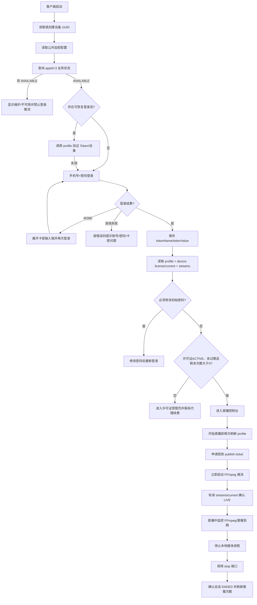

# ZHIBO_LIVE 客户端接入指南

> 本文已更新为已实现的多设备许可证版本。领域设计、数据库约束和 10/11 台验收结果见
> [ZHIBO_LIVE 多设备卡密许可证解决方案](./ZHIBO_LIVE_MULTI_DEVICE_LICENSE_SOLUTION.md)。

> 面向桌面客户端、采集客户端和第三方客户端开发者。本文以当前后端实际接口为准，固定接入
> `appId=3 / bizCode=ZHIBO_LIVE`，覆盖首次启动、设备绑定、账号登录、套餐判断、卡密激活、
> 视频推流、断线重连、停止推流、注销和解绑电脑的完整流程。

## 1. 接入结论

客户端必须遵循以下业务边界：

1. 客户端构建时固定 `appId=3`，不允许最终用户切换 appId，也不能自行提交 bizId。
2. ZHIBO_LIVE 当前是 `ADMIN_ONLY`：账号由管理员或代理创建，客户端不提供自助注册入口。
3. 用户名是手机号；已绑定设备使用“手机号 + 密码 + 稳定设备 UUID”，新设备还必须输入分配给该手机号的卡密。
4. 一张卡密等于一个设备许可证。一个手机号可有多张卡并让多台电脑同时登录；同一张卡不能绑定两台电脑。
5. 登录成功不等于可以推流。客户端必须读取当前设备自己的 `deviceLicense`，检查状态、独立到期时间和独立次数。
6. 卡密首次激活已合并到登录接口；不要在 ZHIBO_LIVE 调用旧的 `/api/v1/card/activate`。续费由代理后台对原卡办理，卡号不变。
7. 每次开始直播都必须先申请短效推流票据，再把服务端返回的完整 `publishUrl` 交给 FFmpeg/OBS。
8. 推流票据不能保存、打印或上报；断线后不能复用，必须重新申请。
9. 客户端不能调用 `/api/v1/internal/mediamtx/**`，这些接口只供 MediaMTX 使用。
10. 服务端是最终授权方。客户端本地检查用于改善体验，不能替代服务端鉴权。

## 2. 推荐客户端模块

```text
ZhiboLiveClient
├─ BusinessBootstrap      appId=3、业务状态、公共加密配置
├─ DeviceIdentity         设备 UUID 生成、持久化和读取
├─ SessionManager         登录、Token 安全保存、会话恢复、注销
├─ EntitlementManager     当前设备许可证、独立到期时间、次数、卡密状态
├─ LiveApi                票据申请、会话查询、停止推流
├─ MediaProcessManager    FFmpeg/OBS 启动、输出监听、停止和崩溃恢复
├─ LiveStateCoordinator   本地媒体状态与服务端会话状态收敛
├─ SecureStorage          Token/账号安全存储，不保存密码和推流票据
└─ DiagnosticLogger       请求目标、期待结果、错误码；敏感字段统一脱敏
```

不要把 HTTP、设备、套餐和 FFmpeg 调用全部写进一个窗口类。媒体进程退出、网络断开和票据过期都需要独立状态管理。

## 3. 完整业务流程



## 4. 通用协议约定

### 4.1 服务地址

生产环境业务 API 必须使用 HTTPS：

```text
https://api.example.com
```

下面所有路径都相对于该地址。开发环境可以使用 `http://127.0.0.1:8080`。

### 4.2 appId 规则

所有请求统一携带：

```http
X-PDK-App-ID: 3
```

登录、改密、卡密激活等带 appId 的 JSON 请求体也必须写 `"appId": 3`。请求头与请求体不一致会返回 `code=40050`。

客户端不能依赖“缺少 appId 时默认回落到 PDD”的兼容行为，否则请求可能进入 appId=1。

### 4.3 通用响应

普通客户端接口返回：

```json
{
  "code": 200,
  "message": "操作成功",
  "data": {},
  "timestamp": 1787940000000
}
```

必须同时处理两层结果：

- HTTP 状态：网络、网关和协议层是否成功；
- JSON `code`：业务是否成功。

当前大部分业务异常会被包装为 HTTP 200，因此绝对不能使用 `httpStatus == 200` 判断登录、激活或票据申请成功。唯一成功条件是：

```text
响应是合法 JSON && code == 200
```

### 4.4 登录后请求头

登录响应会返回 `tokenName` 和 `tokenValue`。后续受保护接口必须携带：

```http
X-PDK-App-ID: 3
X-PDK-Phone: 13900000003
X-PDK-Device-ID: ZL-DEVICE-...
<tokenName>: <tokenValue>
```

不要硬编码 Token 请求头名称，必须使用登录响应中的 `tokenName`。

### 4.5 报文加密

客户端启动时调用：

```http
GET /api/v1/client/config/public
X-PDK-App-ID: 3
```

读取 `encryptionMode/publicKey/kid/publicKeyFingerprint`：

- `off`：可以发送普通 JSON；
- `optional`：建议使用 RSA-OAEP + AES-256-GCM 信封；
- `force`：普通 JSON 会被拒绝，客户端必须使用加密信封；
- `code=42900`：当前客户端不支持强制协议加密。

优先复用项目 Python/C++ SDK，不要自行发明加密格式。完整算法见 `docs/protocol-encryption-design.md`。

## 5. 设备 UUID 设计

### 5.1 生成要求

设备 ID 是客户端安装实例的稳定标识，要求：

- 非空，UTF-8 长度不超过 128；
- 同一台电脑、同一个客户端安装长期保持不变；
- 推荐格式：`ZL-` + UUIDv4，或经过 SHA-256 处理的硬件组合指纹；
- 不建议只使用 MAC 地址，因为网卡可能更换、虚拟化或被系统随机化；
- 写入当前用户的应用数据目录，例如 `%LOCALAPPDATA%/YourCompany/ZhiboLive/device.json`；
- 不要每次启动重新生成。

示例：

```text
ZL-6f9f6866-51d4-46d4-90e6-c008502d326f
```

### 5.2 绑定规则

- 管理员先把一张或多张卡预分配给手机号，此时许可证为 `UNBOUND`。
- 新设备第一次只提交手机号、密码和 deviceId 时返回 `40380`；客户端随后展开卡密输入框。
- 再次登录并携带属于该手机号的未占用卡密，服务端原子创建设备记录、激活许可证并签发设备级 Token。
- 已绑定设备以后无需再次输入卡密；同一张卡在另一设备使用返回 `40383`。
- 普通“注销”只注销当前许可证会话，不解除许可证与电脑绑定。
- “解绑电脑”清除当前许可证的设备关联并注销当前会话；有效期继续流逝，新电脑使用原卡重新绑定。
- 同一手机号的其他许可证、其他设备登录和直播不受本次注销/解绑影响。

设备绑定由服务端记录决定，本地 device.json 只是客户端启动时的稳定来源。

## 6. 启动与业务发现

调用：

```http
GET /api/v1/client/business/by-app/3
X-PDK-App-ID: 3
```

重点读取：

```json
{
  "code": 200,
  "data": {
    "appId": 3,
    "bizCode": "ZHIBO_LIVE",
    "businessName": "直播矩阵",
    "businessDescription": "...",
    "registrationMode": "ADMIN_ONLY",
    "forceInitialPasswordChange": true,
    "configuredStatus": "ACTIVE",
    "effectiveStatus": "AVAILABLE",
    "unavailableReason": null,
    "supportedActions": ["LIVE_PUBLISH"]
  }
}
```

客户端验证：

```text
appId == 3
bizCode == ZHIBO_LIVE
effectiveStatus == AVAILABLE
supportedActions 包含 LIVE_PUBLISH
```

若不可用：

- `DISABLED_BY_ADMIN`：显示“业务维护中”；
- `NOT_IN_DEPLOYMENT`：显示“当前服务器未部署直播业务”；
- `HANDLER_MISSING/HANDLER_UNHEALTHY`：显示“直播服务暂不可用”；
- 禁用登录后的业务操作和开始直播按钮。

## 7. 账号来源与登录

### 7.1 不提供自助注册

ZHIBO_LIVE 当前 `registrationMode=ADMIN_ONLY`。正确开户流程是：

1. 用户线下购买或由代理分配账号；
2. 管理员/代理后台创建手机号账号和初始密码；
3. 管理员在“设备许可证”页给该手机号分配所需数量的卡密；
4. 将手机号、初始密码和每台电脑各自的一张卡密安全发送给用户；
5. 用户在客户端登录。

客户端不显示“短信注册”和“邀请码注册”；调用注册接口会返回 `40322`。

### 7.2 登录接口

```http
POST /api/v1/client/auth/login
X-PDK-App-ID: 3
Content-Type: application/json

{
  "appId": 3,
  "phone": "13900000003",
  "password": "user-password",
  "deviceId": "ZL-6f9f6866-51d4-46d4-90e6-c008502d326f",
  "deviceName": "直播间电脑1",
  "platform": "Windows",
  "clientVersion": "2.0.0",
  "cardKey": null
}
```

如果返回 `40380`，保持手机号/密码/deviceId 不变，让用户填写卡密，再调用同一个登录接口。
`cardKey` 只在这一次请求的内存中使用，不保存、不打印。

成功响应关键字段：

```json
{
  "code": 200,
  "data": {
    "bizId": 3,
    "appId": 3,
    "bizCode": "ZHIBO_LIVE",
    "tokenName": "client-token",
    "tokenValue": "...",
    "phone": "13900000003",
    "status": "ACTIVE",
    "authorizationMode": "DEVICE_LICENSE",
    "deviceLicense": {
      "licenseId": 101,
      "cardKeyMasked": "PDK-****9982",
      "deviceId": "ZL-...",
      "deviceName": "直播间电脑1",
      "status": "ACTIVE",
      "packageName": "直播月卡",
      "expireAt": "2026-09-29T00:00:00",
      "remainingCalls": 20,
      "serverTime": "2026-08-29T10:00:00"
    },
    "mustChangePassword": false
  }
}
```

登录后必须确认 `appId=3`、`bizCode=ZHIBO_LIVE`、`authorizationMode=DEVICE_LICENSE`，并确认
`deviceLicense.deviceId` 与本机一致，再保存 Token。Token 的主体是当前 licenseId，不是整个手机号。

### 7.3 Token 保存和恢复

- Token 优先仅保存在内存。
- “记住登录”使用 Windows DPAPI、macOS Keychain 或 Linux Secret Service；不能明文写 JSON/注册表。
- 不建议保存用户密码；Token 失效后重新显示登录界面。
- 客户端重启后若读取到 Token，调用 `/api/v1/client/account/profile` 验证；失败就清除 Token 并重新登录。
- 服务端登录会话有效期和套餐有效期是两件事。Token 有效但套餐到期时仍不能推流。

### 7.4 初始密码

若登录返回 `mustChangePassword=true`，客户端必须阻止进入直播控制台并引导修改密码：

```http
POST /api/v1/client/auth/change-password
X-PDK-App-ID: 3

{
  "appId": 3,
  "phone": "13900000003",
  "oldPassword": "initial-password",
  "newPassword": "new-strong-password"
}
```

新密码长度 8～64 位，不能与旧密码相同。修改后清除旧登录态并重新登录。

当前接入版本不要把短信“忘记密码”作为可靠的未登录流程；忘记密码先引导用户联系管理员重置。

## 8. 套餐和授权检查

登录成功后立即调用：

```http
GET /api/v1/client/device-license/current
```

重点字段：

```json
{
  "licenseId": 101,
  "cardKeyMasked": "PDK-****9982",
  "deviceId": "ZL-...",
  "status": "ACTIVE",
  "packageName": "直播月卡",
  "expireAt": "2026-09-29T00:00:00",
  "remainingCalls": 20,
  "serverTime": "2026-08-29T10:00:00"
}
```

本地允许进入“可开始直播”状态的条件：

```text
status == ACTIVE
deviceId == 本机 deviceId
expireAt != null && expireAt > serverTime
remainingCalls > 0
```

注意：客户端时间可能被修改。客户端检查只用于提前提示；点击“开始直播”时仍必须调用票据接口，由服务端重新判断。

建议检查时机：

- 登录成功后；
- 客户端从后台恢复时；
- 开始直播前；
- 一场直播结束后；
- 空闲状态每 1～5 分钟刷新一次；
- 网络恢复后立即刷新。

直播过程中客户端应根据 `serverTime/expireAt` 做校准倒计时，并每 30～60 秒刷新当前许可证。
到期时主动停止本地推流；即使客户端未停止，服务端到期任务也会踢掉对应 MediaMTX 流。

## 9. 卡密绑定、查询与续费

### 9.1 新设备首次绑定卡密

ZHIBO_LIVE 不调用旧的公开卡密核销接口。卡密绑定就是登录流程的一部分：

```http
POST /api/v1/client/auth/login
X-PDK-App-ID: 3
Content-Type: application/json

{
  "appId": 3,
  "phone": "13900000003",
  "password": "user-password",
  "deviceId": "ZL-6f9f6866-51d4-46d4-90e6-c008502d326f",
  "cardKey": "PDK-8891-2041-9982",
  "deviceName": "直播间电脑1",
  "platform": "Windows",
  "clientVersion": "2.0.0"
}
```

成功响应同时返回 Token 和 `deviceLicense`。卡密必须是后台已经分配给该手机号的 `ASSIGNED`
卡；任意库存卡、他人卡或已被其他设备占用的卡都不能绑定。

### 9.2 卡密查询

```http
GET /api/v1/client/device-license/current
GET /api/v1/client/devices
GET /api/v1/client/device-license/renewal-history
```

服务端只返回脱敏卡密、当前设备、状态、套餐、独立到期时间和独立次数。不要尝试恢复完整卡密。

```text
PDK-88**-****-9982
```

### 9.3 续费规则

每张卡独立续费：

- 用户线下续费成功后，由代理后台选择目标许可证，对原卡密办理续期；
- `expireAt = max(serverTime, oldExpireAt) + 套餐时长`；
- 原卡密、licenseId 和当前设备绑定不变，并新增销售流水与许可证续费记录；
- 客户端刷新 `/device-license/current` 即可看到新的到期时间和次数；
- 一台设备续费不会延长同手机号其他卡密的期限。

## 10. 开始视频推流

### 10.1 开始前检查

点击“开始直播”后按顺序执行：

1. 检查网络和本地摄像头/编码器；
2. 刷新 business info，确保业务 AVAILABLE；
3. 刷新 `/device-license/current`，确保许可证 ACTIVE、未过期且 `remainingCalls > 0`；
4. 查询 `/streams/current`，处理遗留的 ISSUED/AUTHORIZED/LIVE 会话；
5. 生成全新的 `clientRequestId`；
6. 申请 publish ticket；
7. 收到成功响应后立即启动媒体进程。

### 10.2 申请票据

```http
POST /api/v1/client/zhibo-live/publish-tickets
X-PDK-App-ID: 3
X-PDK-Phone: 13900000003
X-PDK-Device-ID: ZL-...
<tokenName>: <tokenValue>
Content-Type: application/json

{
  "clientRequestId": "ee4dca4c-5191-48e7-a558-26ce201eff68",
  "title": "直播标题",
  "requestedProtocol": "RTMP"
}
```

当前实现只接受 `RTMP`。响应示例：

```json
{
  "code": 200,
  "data": {
    "streamSessionNo": "ls_5af7f0b17991439b8d35134593458b5b",
    "publishUrl": "rtmp://live.example.com:1935/zhibo-live/ls_...?token=...",
    "expiresAt": "2026-08-29T03:01:30",
    "ticketTtlSeconds": 90,
    "status": "ISSUED"
  }
}
```

`publishUrl` 必须作为不透明字符串使用：

- 不解析后自己重新拼接；
- 不保存到数据库或配置文件；
- 不写客户端日志、崩溃上报或埋点；
- 不放入剪贴板；
- 超时或断线后立即丢弃。

### 10.3 启动 FFmpeg

使用参数数组启动进程，不通过 shell 拼接命令：

```python
command = [
    ffmpeg_path,
    "-re",
    "-i", input_file,
    "-c:v", "libx264",
    "-preset", "veryfast",
    "-pix_fmt", "yuv420p",
    "-c:a", "aac",
    "-f", "flv",
    publish_url,
]
subprocess.Popen(command, shell=False)
```

调试日志只记录：

```text
开始 FFmpeg：session=ls_...，host=live.example.com，publishUrl=[REDACTED]
```

不要输出完整参数数组，因为最后一个参数包含票据。

### 10.4 确认真正开播

FFmpeg 进程启动不代表服务端已经收到可用视频。启动后轮询：

```http
GET /api/v1/client/zhibo-live/streams/current
```

根据 `streamSessionNo` 找到本次会话：

| 服务端状态 | 客户端显示 |
| --- | --- |
| `ISSUED` | 已获取地址，等待连接 |
| `AUTHORIZED` | 鉴权成功，等待媒体可用 |
| `LIVE` | 正在直播 |
| `ENDED` | 已结束 |
| `EXPIRED` | 推流地址已过期，需要重新申请 |

建议每 500ms～1s 查询一次，最多等待 10～15 秒。进入 LIVE 后停止高频轮询，改为 10～30 秒一次或只在状态变化时查询。

只有第一次进入 LIVE 时才扣一次使用次数；仅申请票据但从未真正推流不应扣次。

## 11. 推流失败、重连和幂等

### 11.1 启动失败

如果 FFmpeg 在进入 LIVE 前退出：

1. 查询 `/streams/current`；
2. 如果本次会话仍是 ISSUED/AUTHORIZED，调用 stop 接口释放活动会话；
3. 丢弃旧 publishUrl；
4. 延迟 1～3 秒后生成新的 clientRequestId，重新申请票据；
5. 限制自动重试次数，例如最多 3 次，再显示人工诊断信息。

不能对票据申请盲目重放同一个 `clientRequestId`，重复 ID 会返回 `40970`。

### 11.2 直播中断线

网络中断或媒体进程崩溃后，旧票据视为不可再用：

1. 等待服务端会话进入 ENDED，必要时主动调用 stop；
2. 再次检查套餐；
3. 申请新票据；
4. 使用新 URL 建立新推流。

不要让 FFmpeg 对同一个带票据 URL 无限重连。票据已经绑定原 MediaMTX connection ID，其他连接重放会被拒绝。

### 11.3 已有活动会话

票据接口返回 `40971` 表示该账号已有待推流或在线会话。客户端应：

- 查询 streams/current；
- 若是本客户端仍在推流，恢复 UI 为“正在直播”；
- 若是遗留会话，提示用户确认后调用 stop；
- 不要通过更换手机号、deviceId 或 appId 绕过限制。

## 12. 停止推流

用户点击停止时：

1. UI 进入 `STOPPING`，禁用重复点击；
2. 正常停止 FFmpeg/编码器，超时后再强制结束；
3. 调用：

```http
POST /api/v1/client/zhibo-live/streams/{streamSessionNo}/stop
```

4. 查询 streams/current，确认状态为 ENDED；
5. 刷新 profile，更新剩余次数和套餐显示；
6. 清除内存中的 publishUrl 和本场 session 信息。

stop 接口只能停止当前业务、当前登录许可证自己的会话；同手机号其他设备的流不可见、不可停止。
重复停止已结束会话可以按成功处理。

## 13. 注销、解绑和换电脑

### 13.1 普通注销

```http
POST /api/v1/client/auth/logout
```

注销前如果正在直播，先停止直播。注销成功后清除本地 Token，但保留本机 deviceId。
当前许可证仍绑定这台电脑，其他设备会话不受影响。

### 13.2 解绑电脑

```http
POST /api/v1/client/auth/unbind-device
```

解绑前要求当前设备已登录。成功后：

- 服务端把当前许可证和当前设备记录改为未绑定；
- 服务端停止该许可证正在进行的直播，并清除许可证—设备绑定；
- 当前许可证登录会话失效；
- 客户端清除 Token；
- 到期时间和剩余次数保持不变，解绑不会暂停计时；
- 用户可在新电脑用手机号、密码和原卡密登录并绑定新的设备 UUID；
- 同手机号其他卡密和设备完全不受影响。

如果原电脑不可用，客户端无法自行调用解绑接口，需要管理员后台解绑。

## 14. 客户端状态机

推荐 UI 状态：

```text
BOOTING
  -> SERVICE_UNAVAILABLE
  -> LOGGED_OUT
  -> LOGGING_IN
  -> DEVICE_LICENSE_REQUIRED
  -> DEVICE_LICENSE_BINDING
  -> PASSWORD_CHANGE_REQUIRED
  -> LICENSE_ACTIVE / LICENSE_EXPIRED / LICENSE_SUSPENDED / LICENSE_REVOKED
  -> READY
  -> REQUESTING_TICKET
  -> CONNECTING
  -> LIVE
  -> RECONNECT_REQUIRED
  -> STOPPING
  -> READY
  -> SESSION_EXPIRED / DEVICE_KICKED / FROZEN
```

每个状态只允许有限操作。例如 `REQUESTING_TICKET/CONNECTING/LIVE/STOPPING` 时禁止再次点击开始。

## 15. 推荐 UI 页面

### 15.1 登录页

- 手机号、密码；
- 设备卡密输入框默认折叠，收到 `40380` 后展开并聚焦；
- 记住登录状态；
- 当前设备 ID（可复制给客服，但不允许用户随意编辑）；
- 业务名称和业务描述；
- 不显示“注册”入口；
- “忘记密码”当前跳转联系管理员。

### 15.2 套餐与卡密页

- 当前设备名称、许可证状态和套餐名称；
- 到期时间和剩余天/小时；
- 剩余直播次数；
- 当前卡密脱敏显示；
- 当前许可证独立到期时间和服务端校准倒计时；
- 当前设备独立剩余次数；
- “联系代理续费”和“解绑换机”入口。

### 15.3 直播控制台

- 视频源、分辨率、码率、音频源等本地设置；
- 开始/停止按钮；
- 本场 `streamSessionNo`；
- 服务端状态和 FFmpeg 状态；
- 套餐到期倒计时、剩余次数；
- 最近一次错误的用户可读说明；
- 不显示完整 publishUrl。

### 15.4 设备与安全页

- 当前设备 ID；
- 修改密码；
- 注销；
- 解绑电脑；
- 客户端版本和 API 地址；
- 脱敏诊断日志导出。

## 16. 关键错误码处理

| code | 场景 | 客户端动作 |
| --- | --- | --- |
| `200` | 成功 | 继续流程 |
| `40001` | 卡密不存在/格式问题 | 保留输入并提示检查 |
| `40002` | 卡密已使用或作废 | 禁止重试，联系代理 |
| `40007` | 套餐停用或用户已有卡密 | 展示服务端 message；已有卡密时引导后台续费 |
| `40019` | 新旧密码相同 | 要求重新输入 |
| `40050` | appId 缺失或不一致 | 客户端配置错误，记录诊断并停止请求 |
| `40100` | 账号/登录态无效 | 清 Token，返回登录页 |
| `40103` | 设备不一致/被踢 | 停止媒体进程，清 Token，提示解绑或联系管理员 |
| `40105` | 手机号或密码错误 | 留在登录页 |
| `40106` | Token 属于其他 appId | 清 Token，检查客户端构建配置 |
| `40321` | 业务被管理员关闭 | 禁止开始新直播，显示维护状态 |
| `40322` | 不开放自助注册 | 隐藏注册入口 |
| `40371` | 用户被冻结 | 停止业务并联系管理员 |
| `40372` | 未绑定设备 | 重新登录或联系管理员 |
| `40373` | 旧用户级套餐未开通/过期 | 兼容码；新版 ZHIBO_LIVE 通常返回 40381 |
| `40374` | 剩余次数不足 | 联系代理续费 |
| `40380` | 当前电脑尚未绑定许可证 | 展开卡密输入框 |
| `40381` | 当前许可证已到期 | 进入受限页，允许查看/注销/解绑 |
| `40382` | 卡密未分配给当前手机号 | 联系代理核对发卡对象 |
| `40383` | 卡密已绑定其他设备 | 禁止重试，先在原设备或后台解绑 |
| `40384` | 许可证已暂停或作废 | 停止直播并联系管理员 |
| `40385` | 当前设备没有许可证 | 返回许可证绑定页 |
| `40980` | 当前设备已绑定另一张卡 | 显示当前许可证，不重复绑定 |
| `40981` | 卡密并发绑定冲突 | 刷新状态后重试一次 |
| `40970` | clientRequestId 已使用 | 查询会话，不要原样重试 |
| `40971` | 已有活动推流 | 查询并恢复或停止旧会话 |
| `42900` | 服务端强制协议加密 | 升级/启用信封加密 |
| `50350` | 当前部署没有该业务 | 显示服务不可用，禁止重试风暴 |
| `50370` | MediaMTX 未启用 | 禁止开始直播并提示运维 |
| `50371` | 服务端踢流失败 | 查询会话，稍后重试停止 |

始终优先展示服务端 `message`，但不要把其中可能包含的内部信息直接上报第三方。

## 17. 日志与安全要求

以下字段必须脱敏：

```text
password / oldPassword / newPassword
tokenName 对应的 tokenValue
cardKey
publishUrl
URL 查询参数 token
短信验证码
加密信封的 enc/data
```

推荐调试日志格式：

```text
[请求] POST /api/v1/client/zhibo-live/publish-tickets
[期待] code=200，返回短效推流会话；不打印 publishUrl
[响应] HTTP=200, code=40381, message=当前设备许可证已到期
```

客户端崩溃上报前也必须经过相同脱敏器。生产环境不要记录完整 HTTP body。

## 18. 参考实现

### 18.1 Python SDK

```python
from pdk import PdkApiClient

client = PdkApiClient(
    base_url="https://api.example.com",
    app_id=3,
    device_id="ZL-6f9f6866-51d4-46d4-90e6-c008502d326f",
    auto_envelope=True,
    public_key_pin="部署时预置的服务端公钥指纹",
)

runtime = client.business_info()
assert runtime["code"] == 200
assert runtime["data"]["effectiveStatus"] == "AVAILABLE"

login = client.login("13900000003", "user-password")
if login["code"] == 40380:
    # 卡密应由安全输入框取得；这里只展示参数位置，禁止写死或落盘。
    login = client.login("13900000003", "user-password", card_key=input_card_key_once())
if login["code"] != 200:
    raise RuntimeError(login["message"])

license_state = client.current_device_license()
if license_state["code"] != 200 or license_state["data"]["status"] != "ACTIVE":
    raise RuntimeError(license_state["message"])

ticket = client.create_live_publish_ticket(title="客户端直播")
if ticket["code"] != 200:
    raise RuntimeError(ticket["message"])

publish_url = ticket["data"]["publishUrl"]  # 仅在内存中短暂使用
session_no = ticket["data"]["streamSessionNo"]
# 将 publish_url 直接交给 FFmpeg，日志中不得输出。
```

SDK 路径：`sdk/python/pdk/client.py`。

### 18.2 PyQt/FFmpeg Demo

完整最小流程见：

```text
client-pyqt/live_push_demo.py
```

它展示了 appId=3 登录、票据申请、敏感 URL 脱敏以及 FFmpeg 参数数组启动方式。

## 19. 客户端验收清单

- [ ] 发布构建固定 appId=3，UI 无业务切换器。
- [ ] 启动时检查 business info 和公共加密配置。
- [ ] 设备 ID 首次生成后能跨重启保持不变。
- [ ] ZHIBO_LIVE 不显示自助注册入口。
- [ ] 登录后动态使用 tokenName，并携带手机号、设备和 appId 请求头。
- [ ] Token、密码和卡密不明文落盘。
- [ ] 新设备收到 40380 后才展开卡密框，并使用同一登录接口再次提交。
- [ ] 卡密不属于手机号、已占用或作废时能正确处理 40382/40383/40384。
- [ ] 登录后、开播前和结束后刷新 `/device-license/current`。
- [ ] 许可证非 ACTIVE、已过期或次数为 0 时不能点击开始直播。
- [ ] 一张卡绑定成功后不再重复要求输入；同手机号其他设备各用自己的卡。
- [ ] 到期设备进入受限页，仍允许查看许可证、注销和解绑。
- [ ] 每次开播使用新 clientRequestId 和新 publish ticket。
- [ ] publishUrl 不出现在 UI、日志、剪贴板和崩溃上报。
- [ ] FFmpeg 启动后以服务端 LIVE 状态作为开播成功依据。
- [ ] 启动失败时停止遗留会话后再申请新票据。
- [ ] 断线重连不复用旧票据。
- [ ] 停止直播后调用 stop 并确认 ENDED。
- [ ] 设备被踢、Token 失效或用户冻结时立即停止媒体进程。
- [ ] 注销和解绑电脑是两个独立操作，UI 说明清楚。
- [ ] 所有接口同时判断 HTTP 状态、JSON 格式和业务 code。
- [ ] 网络重试有退避、次数上限和幂等策略。

## 20. 当前服务端边界

客户端接入时需要知道以下当前边界：

1. 当前推流协议只开放 RTMP；公网正式发布前服务端还应部署 RTMPS 证书和加密入口。
2. 当前每个设备许可证同一时间只允许一个活动推流会话；同手机号的不同许可证可以各自推流。
3. 当前按“成功开播次数”扣费，不按分钟、码率或清晰度计费。
4. 许可证到期、解绑、暂停、作废和用户冻结已经会精确停止相应许可证的活动流。
5. 客户端仍应监测许可证到期、设备错误和本地媒体进程，以提供及时 UI；服务端始终是授权权威。

服务端 MediaMTX 设计、部署和测试资料分别见：

- `docs/ZHIBO_LIVE_MEDIAMTX_AUTH_SOLUTION.md`
- `docs/ZHIBO_LIVE_MEDIAMTX_DEVELOPMENT.md`
- `docs/ZHIBO_LIVE_MEDIAMTX_TECHNICAL.md`
- `docs/ZHIBO_LIVE_MEDIAMTX_TEST.md`
