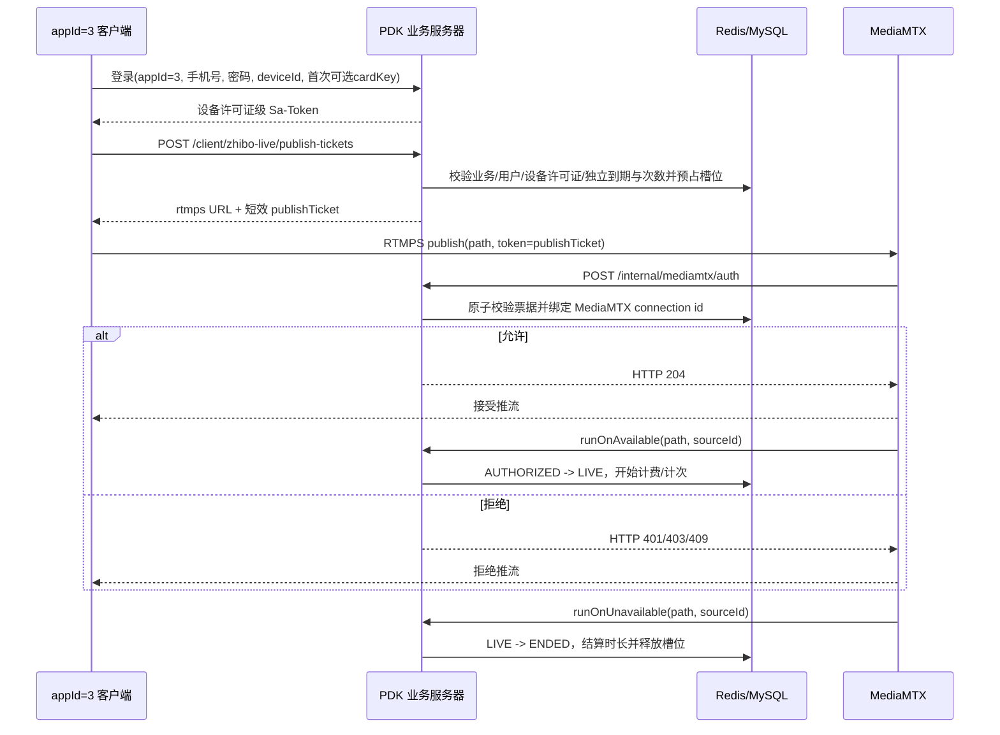

# ZHIBO_LIVE 接入 MediaMTX HTTP Auth 后端方案

> 本文是总体设计和后续演进蓝图。当前可运行实现、部署方式、测试步骤与逐项完成度分别见：
> [开发说明](./ZHIBO_LIVE_MEDIAMTX_DEVELOPMENT.md)、[技术说明](./ZHIBO_LIVE_MEDIAMTX_TECHNICAL.md)、
> [测试说明](./ZHIBO_LIVE_MEDIAMTX_TEST.md)、[完成情况](./ZHIBO_LIVE_MEDIAMTX_IMPLEMENTATION_STATUS.md)。
> 当前 MVP 使用 RTMP 完成端到端准入；生产公网必须补配证书并切换 RTMPS 后再上线。

## 1. 结论

该方案可行，适用于当前 `appId=3 / bizId=3 / bizCode=ZHIBO_LIVE`，但要把三个职责分开：

1. **客户端业务登录**：使用手机号、密码、设备 UUID 和设备卡密许可证鉴权；已绑定设备可省略卡密，Sa-Token 主体为 `license:{id}`。
2. **RTMP 推流准入**：登录后的客户端向业务服务器申请短效、专用、可撤销的推流票据；MediaMTX 在收到 publish 连接时通过 HTTP auth 向业务服务器同步核验。
3. **推流生命周期**：HTTP auth 只说明“允许连接”，不说明流已经可用。真正上线和下线使用 MediaMTX 的 `runOnAvailable`、`runOnUnavailable` 事件；中途停权使用 Control API 主动踢流。

不应把客户端 Sa-Token、登录密码或卡密直接放进 RTMP URL。RTMP 地址可能出现在客户端日志、MediaMTX 日志、崩溃报告和代理日志中，泄漏长期凭证会同时危及业务 API。推荐使用 256 bit 随机、60～120 秒有效、只允许 publish 的不透明票据。

## 2. 总体架构



业务服务器是用户、套餐、权限和推流会话的权威来源；MediaMTX 只负责媒体协议与执行准入结果。

## 3. 与现有多业务体系的结合

### 3.1 固定业务边界

所有客户端推流接口必须先通过现有 `DeviceSecurityInterceptor`：

- `X-PDK-App-ID=3`；
- Sa-Token 已登录；
- Token 对应 `pdk_device_license.biz_id=3` 且许可证属于当前用户；
- `X-PDK-Phone` 与用户一致；
- `X-PDK-Device-ID` 与当前许可证绑定的 `pdk_user_device` 一致；
- `pdk_business` 中 `ZHIBO_LIVE` 为 `ACTIVE`；
- 当前部署 allowlist 包含 `ZHIBO_LIVE` 或聚合别名 `ZHIBO`；
- `ZhiboBusinessHandler` 健康。

不能根据客户端上传的 `bizId` 或 `bizCode` 决定业务，只能通过服务端 `appId=3 -> BusinessContext` 解析。

### 3.2 业务目录

MediaMTX 逻辑属于直播业务特有能力，建议放入聚合目录的 live 子目录：

```text
backend-springboot/src/main/java/com/pdk/business/zhibo/live/
├─ controller/
│  ├─ ZhiboLiveClientController.java
│  ├─ MediaMtxAuthController.java
│  ├─ MediaMtxEventController.java
│  └─ ZhiboLiveAdminController.java
├─ service/
│  ├─ PublishTicketService.java
│  ├─ LiveStreamSessionService.java
│  ├─ MediaMtxControlClient.java
│  └─ LiveEntitlementService.java
├─ dto/
├─ entity/
├─ mapper/
└─ job/
   ├─ LiveEntitlementMonitorJob.java
   └─ MediaMtxReconcileJob.java
```

通用登录、业务解析、套餐、用户和设备机制继续复用 `platform`，不复制一套 zhibo 用户中心。

## 4. 推流票据流程

### 4.1 客户端申请票据

```http
POST /api/v1/client/zhibo-live/publish-tickets
X-PDK-App-ID: 3
X-PDK-Phone: 138...
X-PDK-Device-ID: UUID...
satoken: ...
```

请求体示例：

```json
{
  "clientRequestId": "6c644804-1971-4f74-ae85-9a71368e390d",
  "title": "直播测试",
  "requestedProtocol": "rtmps"
}
```

业务服务器依次校验：

1. 当前业务必须是 `ZHIBO_LIVE`，不能让 `ZHIBO_AI` 申请推流。
2. 用户未冻结、凭证有效、许可证和设备仍绑定。
3. 当前设备许可证为 ACTIVE 且独立 `expire_at` 未到期。
4. 当前设备许可证拥有剩余开播次数。
5. 当前许可证没有其他 `ISSUED/AUTHORIZED/LIVE` 会话。
6. 分配到健康且已启用的 MediaMTX 节点。
7. 原子预占一个推流槽位并创建会话。

响应示例：

```json
{
  "streamSessionNo": "ls_01K4D8K7H8M2J",
  "publishUrl": "rtmps://live.example.com/zhibo-live/ls_01K4D8K7H8M2J?token=***",
  "expiresAt": "2026-08-28T18:02:00+08:00",
  "ticketTtlSeconds": 90
}
```

生产环境推荐直接返回完整 URL，客户端无需理解票据结构。客户端日志必须把 `token` 查询参数替换为 `***`。

### 4.2 路径规则

推荐路径：

```text
zhibo-live/{streamSessionNo}
```

路径中不放手机号、密码、设备 UUID、套餐 ID。服务端通过随机会话号查询真实用户，并要求票据中绑定的 path 与 MediaMTX 请求的 path 完全相同。

### 4.3 票据规则

- 使用安全随机数生成至少 32 字节，Base64URL 编码后约 43 字符。
- 数据库和 Redis 只存 `SHA-256(ticket)`，不存明文。
- 默认 90 秒过期，只授权 `protocol=rtmp`、`action=publish` 和一个固定 path。
- 绑定 `bizId=3 + userId + userDeviceId + deviceLicenseId + deviceIdHash + mediaNodeId + streamSessionNo`。
- 第一次 HTTP auth 成功时原子绑定 MediaMTX `id`。
- 相同票据和相同连接 ID 的重复鉴权可幂等成功；不同连接 ID 重放必须拒绝。
- 客户端重连必须重新申请票据，不能长期复用旧地址。

由于 MediaMTX 的 HTTP auth 本来就会回源业务服务器，首期推荐不透明票据，不需要 JWT。它更短、可单独撤销，也避免 RTMP 客户端 URL 长度限制。

## 5. MediaMTX HTTP Auth 接口

### 5.1 MediaMTX 配置

```yaml
authMethod: http
authHTTPAddress: http://pdk-backend:8080/api/v1/internal/mediamtx/auth

# 如果 Control API、metrics、pprof 只监听内网并由防火墙保护，可排除这些管理动作。
# 不要排除 publish，否则推流不会经过业务鉴权。
authHTTPExclude:
  - action: api
  - action: metrics
  - action: pprof

api: yes
apiAddress: 0.0.0.0:9997

pathDefaults:
  runOnAvailable: /opt/pdk/bin/mediamtx-event available
  runOnUnavailable: /opt/pdk/bin/mediamtx-event unavailable
```

Control API 不能暴露到公网；若排除了 `action=api` 的 HTTP auth，必须依靠私网监听、防火墙或反向代理鉴权。

### 5.2 MediaMTX 请求格式

当前 MediaMTX 会向 `authHTTPAddress` 发送 POST JSON，字段包括：

```json
{
  "user": "",
  "password": "",
  "token": "opaque-publish-ticket",
  "ip": "203.0.113.10",
  "action": "publish",
  "path": "zhibo-live/ls_01K4D8K7H8M2J",
  "protocol": "rtmp",
  "id": "mediamtx-connection-id",
  "query": "token=opaque-publish-ticket",
  "userAgent": "..."
}
```

RTMP 官方支持通过 `?token=...` 传递 token，因此不需要把业务账号密码交给 MediaMTX。

### 5.3 响应语义

这是整个实现最容易出安全事故的地方：**不能返回 HTTP 200 再在 JSON 中写业务错误码**。MediaMTX 只判断 HTTP 状态，任何 `20x` 都视为鉴权成功。

建议响应：

| HTTP 状态 | 含义 |
| --- | --- |
| `204` | 允许本次 publish |
| `400` | MediaMTX 请求字段不完整或格式错误 |
| `401` | 票据缺失、无效、过期或签发记录不存在 |
| `403` | 非 ZHIBO_LIVE、用户/业务/套餐已停用、path 或 protocol 不匹配 |
| `409` | 票据被其他连接使用、超过并发数或同 path 已有发布者 |
| `429` | 来源异常、短时间鉴权失败次数过多 |
| `5xx` | 业务服务内部异常；MediaMTX 应拒绝连接，系统按 fail-closed 处理 |

该 Controller 返回裸 `ResponseEntity<Void>`，不经过 `CommonResult` 的统一 HTTP 200 包装，也不经过客户端加密 Advice。

### 5.4 鉴权顺序

HTTP auth 必须是低延迟、无外部慢调用的快速路径：

1. 校验请求来源是受信 MediaMTX 内网地址或网关。
2. 只接受 `action=publish` 和 `protocol=rtmp`；其他动作按明确策略处理。
3. 校验 path 以 `zhibo-live/` 开头并符合严格正则。
4. 对 token 计算 SHA-256，查询 Redis 票据。
5. 校验 TTL、bizId、path、node、用户、设备和业务版本。
6. 原子执行 `ISSUED -> AUTHORIZED` 并绑定 `mediamtxConnectionId`。
7. 写轻量审计并返回 204。

建议目标：P95 小于 100 ms，超时不超过 1～2 秒。Redis 不可用时不能直接放行；可以使用带行锁的 MySQL 原子校验作为降级，否则 fail-closed。

## 6. 推流生命周期

### 6.1 状态机

```text
REQUESTED
   -> ISSUED
   -> AUTHORIZED
   -> LIVE
   -> ENDED

ISSUED      -> EXPIRED / CANCELLED
AUTHORIZED  -> FAILED / EXPIRED
LIVE        -> KICKED / ENDED
任意非结束状态 -> REVOKED（业务/用户/套餐被停用）
```

HTTP auth 成功只能进入 `AUTHORIZED`；只有 `runOnAvailable` 才能进入 `LIVE`。扣“开播次数”应在第一次进入 LIVE 时执行，不能在申请票据或 HTTP auth 时扣，因为客户端可能从未真正推送音视频。

### 6.2 上线/下线事件

MediaMTX 当前使用：

- `runOnAvailable`：流已经可以被读取；可获得 `MTX_PATH`、`MTX_QUERY`、`MTX_SOURCE_TYPE`、`MTX_SOURCE_ID`。
- `runOnUnavailable`：流不再可用。

建议 `/opt/pdk/bin/mediamtx-event` 把必要字段转成 JSON，通过内网调用：

```http
POST /api/v1/internal/mediamtx/events/available
POST /api/v1/internal/mediamtx/events/unavailable
```

事件包含 `eventId/nodeId/path/sourceType/sourceId/eventTime` 并使用 HMAC 签名。不要转发或记录 `MTX_QUERY`，其中可能含明文推流票据。

事件处理必须幂等：同一个 `nodeId + eventType + sourceId + path` 重复发送不能重复扣次或重复结算。

### 6.3 事件丢失恢复

Hook 属于事件通知，不应作为唯一事实来源。增加 `MediaMtxReconcileJob` 定期调用 Control API：

```text
GET /v3/rtmpconns/list
GET /v3/rtmpsconns/list
```

将 MediaMTX 当前连接与数据库 `AUTHORIZED/LIVE` 会话对账：

- 数据库 LIVE，但 MediaMTX 已无连接：补记 ENDED。
- MediaMTX 存在 publish，但数据库无授权会话：立即 kick 并告警。
- AUTHORIZED 长时间未进入 LIVE：标记 FAILED，释放并发槽位。

## 7. 中途停权和主动停止

HTTP auth 不会持续回调。用户已经推流后，如果发生以下情况，需要业务服务器主动踢流：

- 管理员停用 `ZHIBO_LIVE`；
- 用户被冻结、设备解绑或登录失效；
- 套餐到期、直播分钟耗尽；
- 管理员手工停止；
- 同一用户违反并发或风控策略。

MediaMTX 当前 Control API 提供：

```http
POST /v3/rtmpconns/kick/{id}
POST /v3/rtmpsconns/kick/{id}
```

业务服务器根据会话保存的 nodeId、协议和 connection/source ID 调用对应节点。kick 成功后会话标记 `KICK_REQUESTED`，最终由 unavailable 事件或对账任务收敛为 `KICKED/ENDED`。

客户端主动停止可调用：

```http
POST /api/v1/client/zhibo-live/streams/{streamSessionNo}/stop
```

服务端必须校验会话属于当前 bizId、用户和设备，不能让客户端传入任意 MediaMTX connection ID 踢其他人的流。

## 8. 数据库设计

当前项目采用全新数据库基线，落地时直接把最终 `CREATE TABLE` 加入 `schema-mysql.sql`，不增加 ALTER 兼容段。

### 8.1 `pdk_live_stream_session`

建议字段：

```text
id
biz_id                         固定关联 ZHIBO_LIVE 的 bizId=3
user_id
stream_session_no              对客户端公开的随机会话号
media_node_id
path
protocol                        RTMP/RTMPS
slot_no                         用户并发槽位编号
status
ticket_hash                     SHA-256，不保存明文票据
ticket_expires_at
device_id_hash
client_request_id               客户端幂等键
client_ip
mediamtx_connection_id
mediamtx_source_id
authorized_at
started_at
ended_at
duration_seconds
billed_units
end_reason
created_at / updated_at
```

关键索引：

```text
UNIQUE(stream_session_no)
UNIQUE(ticket_hash)
UNIQUE(biz_id, user_id, client_request_id)
UNIQUE(media_node_id, mediamtx_connection_id)
INDEX(biz_id, user_id, status, created_at)
INDEX(media_node_id, status)
INDEX(status, ticket_expires_at)
```

并发槽位需要数据库唯一保护，不能只做 `count(*)` 后再插入。可增加仅在 `ISSUED/AUTHORIZED/LIVE` 状态生成值的生成列，并建立 `(biz_id,user_id,active_slot)` 唯一键；结束状态生成 `NULL`，自动释放槽位。

### 8.2 `pdk_live_stream_event`

保存 append-only 生命周期审计：

```text
event_id, biz_id, session_id, media_node_id, event_type,
source_id, event_time, payload_digest, processed_status, created_at
```

原始 payload 中不得保存票据、password 或完整 query。

### 8.3 `pdk_media_server_node`

用于多节点管理：

```text
id, node_code, biz_id, public_rtmps_base_url,
internal_api_url, status, weight, max_publishers,
last_health_at, created_at, updated_at
```

Control API 密钥、Hook HMAC 密钥和 TLS 私钥不进普通数据库，使用环境变量、Docker/Kubernetes Secret 或 KMS。

### 8.4 套餐扩展

现有套餐的“账号数/调用次数”不足以完整表达直播权益。建议增加业务扩展表：

```text
pdk_zhibo_live_package_policy
  package_plan_id
  biz_id
  max_concurrent_streams
  max_single_stream_seconds
  included_stream_starts
  included_stream_minutes
  max_video_bitrate_kbps
  allowed_resolution
```

不要把直播特有字段塞进所有业务共用的 `pdk_package_plan`。公共套餐保存价格、折扣和有效期，直播扩展表保存直播执行参数。

## 9. Redis 设计

```text
pdk:live:ticket:{ticketSha256}
  -> sessionNo,bizId,userId,deviceHash,nodeId,path,connectionId,expireAt

pdk:live:session:{streamSessionNo}
  -> status,nodeId,connectionId,sourceId

pdk:live:user-slots:{bizId}:{userId}
  -> 当前预占/在线槽位

pdk:live:auth-fail:{sourceIp}
  -> 短时失败计数
```

Redis 用于快速鉴权和 TTL，MySQL 保留权威会话及审计。状态转换使用 Lua 或带版本号 CAS，防止两个 RTMP 连接同时消费同一票据。

## 10. 安全要求

1. 客户端到 MediaMTX 使用 RTMPS，避免票据在公网明文传输。
2. MediaMTX 到业务服务器走私网；auth 和 event 接口不暴露到公网，并限制来源 IP/网段。
3. auth endpoint 不使用 Sa-Token，但必须有“仅 MediaMTX 可访问”的网络信任边界。
4. Control API 只监听私网，不允许客户端直接访问。
5. 日志统一脱敏 `token/password/query/publishUrl`。
6. 票据仅授权 publish，不能复用为 read、API 或业务登录 Token。
7. auth 服务异常时拒绝推流，不能为了可用性 fail-open。
8. 管理员禁用业务时，先停止签发票据，再撤销未使用票据，最后 kick 现有连接。
9. 对同 IP 大量无效票据增加限流和告警；MediaMTX 日志侧可配合 fail2ban。
10. 多个 MediaMTX 节点必须各自有 nodeId，票据不能跨节点使用。

## 11. 管理后台

业务管理页为 ZHIBO_LIVE 增加：

- MediaMTX 节点列表、健康状态、当前在线推流数和容量；
- 默认票据 TTL、默认并发数、单场最长时长；
- HTTP auth 成功率、拒绝原因、P95 延迟；
- 在线会话列表：用户、设备、path、节点、开始时间、用量；
- 管理员主动踢流；
- 最近异常：票据重放、跨节点使用、无授权流、Hook 丢失对账。

PARTNER 只能查看自己业务范围内的流；SUPER_ADMIN 可以查看所有节点和执行踢流。所有范围限制必须由后端强制。

## 12. 客户端行为

客户端不直接拼接永久 RTMP 地址：

1. 登录 appId=3。
2. 点击开始直播时申请 publish ticket。
3. 收到 URL 后立即推流；票据过期则重新申请。
4. RTMP 连接失败时再查询业务服务器会话状态，显示明确原因，例如套餐到期、业务关闭、设备解绑或并发已满。
5. 客户端本地日志显示请求目标与期待结果，但完整 publish URL 必须脱敏。
6. 用户点击停止时先停止本地编码器，再调用 stop 接口帮助服务端快速收敛状态。

MediaMTX 拒绝时，RTMP 客户端通常只能得到泛化的连接失败。因此业务服务器的票据申请接口和会话查询接口应提供用户可读的错误原因。

## 13. 建议接口清单

### 客户端

```text
POST /api/v1/client/zhibo-live/publish-tickets
GET  /api/v1/client/zhibo-live/streams/{streamSessionNo}
POST /api/v1/client/zhibo-live/streams/{streamSessionNo}/stop
GET  /api/v1/client/zhibo-live/streams/current
```

### MediaMTX 内部接口

```text
POST /api/v1/internal/mediamtx/auth
POST /api/v1/internal/mediamtx/events/available
POST /api/v1/internal/mediamtx/events/unavailable
```

### 管理后台

```text
GET  /api/v1/admin/zhibo-live/streams
GET  /api/v1/admin/zhibo-live/streams/{streamSessionNo}
POST /api/v1/admin/zhibo-live/streams/{streamSessionNo}/kick
GET  /api/v1/admin/zhibo-live/media-nodes
POST /api/v1/admin/zhibo-live/media-nodes/{nodeId}/health-check
```

## 14. 分阶段落地

### 第一阶段：准入 MVP

- 推流票据、HTTP auth、单许可证单流；
- `ISSUED/AUTHORIZED/LIVE/ENDED` 状态；
- available/unavailable Hook；
- 管理后台在线流和手工踢流；
- RTMPS、日志脱敏和基础限流。

### 第二阶段：商业化权益

- 直播套餐扩展策略；
- 并发槽位、开播次数、直播分钟计费；
- 套餐到期和额度耗尽自动踢流；
- 销售/消费统计按 bizId 汇总。

### 第三阶段：高可用

- 多 MediaMTX 节点调度；
- Control API 对账和 Hook 丢失恢复；
- 节点容量、熔断、故障迁移；
- auth 延迟、拒绝率和异常重放监控。

## 15. 验收用例

1. appId=2 或 appId=1 用户不能申请 appId=3 推流票据。
2. 未登录、设备不一致、用户冻结、套餐过期时不能获得票据。
3. 无 token、伪造 token、过期 token、错误 path 或非 RTMP publish 均返回非 20x。
4. 同一票据被第二个 MediaMTX connection ID 使用时拒绝。
5. HTTP auth 返回 JSON 业务错误但 HTTP 200 的错误实现必须由测试阻止。
6. auth 通过但客户端未真正推流时不扣次数。
7. 第一次 available 只扣一次，重复 Hook 不重复扣费。
8. unavailable 正确结算时长并释放并发槽位。
9. 用户直播中被冻结、套餐到期或业务关闭时，Control API 能踢掉连接。
10. Hook 丢失后，对账任务可以把数据库和 MediaMTX 状态收敛一致。
11. 日志、审计、后台响应中不出现明文 publish ticket。
12. 业务服务器或 Redis 故障时不能绕过鉴权继续新开流。

## 16. MediaMTX 版本基线

本文按 MediaMTX 当前官方文档及 Control API v1.20.1 设计。部署时应固定 MediaMTX 镜像版本，不使用浮动 `latest`，升级前对 HTTP auth payload、Hook 名称和 `/v3/rtmpconns` API 做契约回归。

官方参考：

- [MediaMTX Authentication](https://mediamtx.org/docs/features/authentication)
- [MediaMTX Hooks](https://mediamtx.org/docs/features/hooks)
- [MediaMTX Control API](https://mediamtx.org/docs/references/control-api)
- [MediaMTX v1.20.1 OpenAPI](https://github.com/bluenviron/mediamtx/blob/v1.20.1/api/openapi.yaml)
