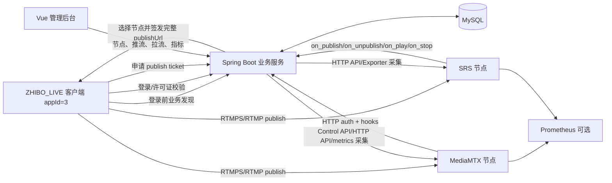
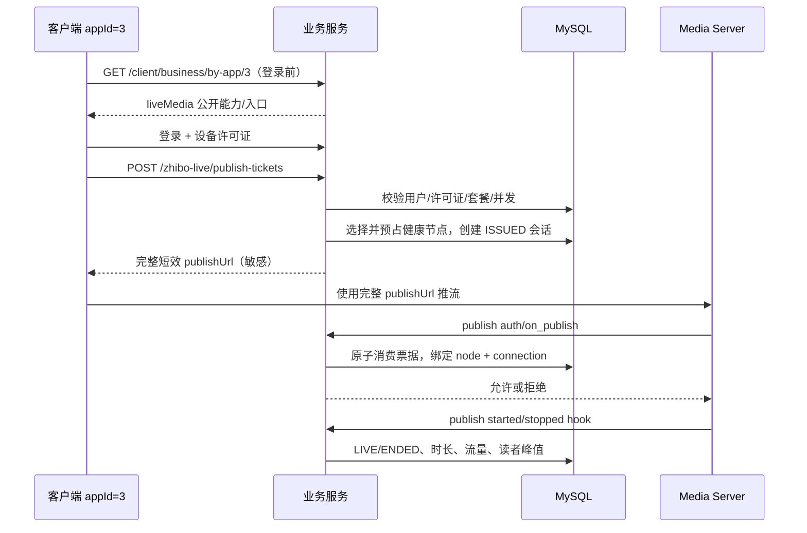

# ZHIBO_LIVE 流媒体节点、推拉流与监控管理技术方案

> 文档状态：已按本方案完成核心实现；生产环境增强项见第 18 节验收清单和完成情况文档  
> 适用范围：`appId=3 / bizCode=ZHIBO_LIVE / bizId=3`  
> 不适用业务：`PDD(appId=1)`、`ZHIBO_AI(appId=2)`  
> 基于当前项目代码与数据库结构整理，目标是指导后续数据库、Spring Boot、Vue 管理后台和客户端开发。

## 1. 结论

需求总体合理，但有两个关键点需要修正。

第一，流媒体服务器是 **ZHIBO_LIVE 业务级基础设施**，不应作为某个用户的属性配置在用户表或用户编辑弹窗里。正确位置是：

- 业务管理页选择 `ZHIBO_LIVE` 后，出现“媒体节点配置”入口；
- 独立的“直播中心”负责节点、在线推流、拉流会话和指标展示；
- 用户管理页在选择 `ZHIBO_LIVE` 时，只展示该用户的许可证、当前直播、所用节点以及跳转入口，不修改节点基础配置。

第二，客户端可以在登录前获取公开的媒体服务能力和公开入口，但 **不应自行拼接最终推流 URL**。现有服务端已经使用短效票据并返回完整 `publishUrl`，该 URL 同时绑定节点、path、票据和会话。若客户端自行拼接，会破坏节点调度、票据绑定、RTMPS 切换和后续 SRS 兼容。推荐语义如下：

- 登录前：获取 `liveMedia.mediaServerAddress`，用于服务可用性判断、界面提示或网络预检；
- 登录后且准备开播：调用票据接口，由服务端选择节点并返回完整、短效、不可拆解的 `publishUrl`；
- 客户端把 `publishUrl` 当作不透明敏感字符串直接交给 FFmpeg/OBS，不记录、不缓存、不自行改写。

## 2. 当前项目实现现状

### 2.1 已有能力

当前项目已经具备直播准入和节点管理闭环：

- `pdk_live_stream_session` 保存 appId=3 的推流票据和推流生命周期；
- `LiveStreamSessionService` 签发 90 秒短效票据；
- `MediaMtxAuthService` 校验登录用户、设备许可证、套餐、设备、path、协议和票据；
- MediaMTX HTTP auth 未通过时拒绝推流；
- MediaMTX available/unavailable Hook 将会话推进为 `LIVE/ENDED`；
- 客户端可以查询当前设备许可证的直播会话并停止推流；
- 后端已有管理端直播会话列表和踢流接口；
- `LIVE_STREAM_VIEW`、`LIVE_STREAM_KICK` 权限已经存在；
- 数据库仅保存票据 SHA-256，不保存明文票据。
- 媒体节点数据库管理、多节点容量选路和 DRAINING；
- MediaMTX/SRS Provider、健康与指标采集、踢流；
- 登录前 `liveMedia` 公开发现；
- 独立拉流会话、read/unread 状态流转；
- 管理后台直播中心、Dashboard 和审计；
- SUPER_ADMIN/PARTNER 权限与代理数据隔离。

### 2.2 实现状态与生产增强

| 能力 | 当前实现 | 仍需生产增强 |
| --- | --- | --- |
| 节点配置 | 数据库管理 MediaMTX/SRS 节点，配置仅 SUPER_ADMIN 可改 | Secret Manager/KMS 与单节点密钥轮换 |
| 厂商适配 | Provider SPI 已支持 `MEDIAMTX`、`SRS` | 真实 SRS 部署黑盒验收 |
| 登录前发现 | appId=3 返回裁剪后的 `liveMedia` | 公网域名、RTMPS/HTTPS/WSS 证书部署 |
| 推流选路 | 按健康、容量、协议、权重选节点并绑定会话 | 跨机房调度、容量预占与故障迁移 |
| 推流管理 | 后端查询/踢流、审计及 Vue 直播中心已实现 | 长期历史查询和导出 |
| 拉流 | read 鉴权、read/unread Hook 和独立拉流连接表已实现 | 对具体观众授权时增加独立 play ticket |
| 带宽 | 采集累计字节并计算 bps，首个样本显示 null | Prometheus/Grafana 历史趋势与告警 |
| Dashboard | SUPER_ADMIN 显示全局直播指标；PARTNER 概览按许可证隔离 | 峰值、趋势和地域维度 |
| 对账 | Hook 幂等，节点定时健康/指标采集已实现 | Control API 与数据库活动会话自动对账 |

必须特别说明：当前 `pdk_live_stream_session` 是 **推流发布会话表**，不是推流和拉流混合表。它没有 reader/client 维度，也不能仅靠该表得出真实拉流人数。

## 3. 业务边界与不变量

### 3.1 appId=3 专属约束

所有直播节点、推流会话、拉流会话、直播指标和内部回调必须满足：

```text
appId = 3
bizCode = ZHIBO_LIVE
business.id = bizId
```

业务表只保存 `biz_id`，不重复保存 `app_id`。服务层通过 `pdk_business` 验证该 `biz_id` 的 appId 和 bizCode。这样可避免 `app_id` 与 `biz_id` 两份数据不一致。

PDD 和 ZHIBO_AI 不创建媒体节点、不下发 `liveMedia`、不展示直播菜单，也不能访问直播内部接口。直播相关 Controller 仍要在后端强制校验，不能只依赖前端隐藏菜单。

### 3.2 配置边界

节点配置分成三类：

| 类型 | 示例 | 保存位置 |
| --- | --- | --- |
| 客户端公开配置 | RTMPS/HLS/WebRTC 公网入口、支持协议 | `pdk_media_server_node` |
| 后端内部连接配置 | Control API 地址、Metrics 地址、区域、容量、权重 | `pdk_media_server_node` |
| 敏感配置 | Control API 密码、Hook 密钥、证书私钥 | 本地 Secret 文件/KMS/容器 Secret，数据库只保存 `secret_ref` |

管理后台不得向浏览器返回 Control API 密码、内部 Hook token、完整推流票据或 Secret 内容。

### 3.3 节点状态与业务开关

ZHIBO_LIVE 可以启用的必要条件应扩展为：

```text
pdk_business.status = ACTIVE
AND PDK_ENABLED_BIZ_CODES 包含 ZHIBO_LIVE（或 ZHIBO 聚合别名）
AND ZhiboBusinessHandler 已注册且健康
AND 至少存在 1 个 status=ACTIVE 且配置完整的媒体节点
```

建议区分：

- `ACTIVE`：接受新推流；
- `DRAINING`：不接受新推流，已有推流继续，适合维护/下线；
- `DISABLED`：不接受新推流，并由管理员决定是否立即踢掉现有会话；
- `health_status=UP/DOWN/DEGRADED/UNKNOWN`：探测结果，不等于人工开关。

## 4. 目标架构



Spring Boot 是节点配置、用户授权、票据签发和管理查询的权威服务。MediaMTX/SRS 只负责媒体传输及连接层状态，不直接理解套餐、卡密或设备许可证。

## 5. 目录与适配层设计

保持现有 `business/zhibo/live` 业务隔离，并在其下增加通用媒体节点层：

```text
com.pdk.business.zhibo.live
├─ controller
│  ├─ ZhiboLiveClientController
│  ├─ ZhiboLiveAdminController
│  └─ MediaServerInternalController
├─ media
│  ├─ MediaServerProvider.java
│  ├─ MediaServerProviderRegistry.java
│  ├─ MediaServerNodeSelector.java
│  ├─ MediaServerHealthService.java
│  ├─ MediaServerMetricsService.java
│  ├─ MediaServerReconcileJob.java
│  ├─ mediamtx
│  │  ├─ MediaMtxProvider.java
│  │  ├─ MediaMtxAuthAdapter.java
│  │  └─ MediaMtxApiClient.java
│  └─ srs
│     ├─ SrsProvider.java
│     ├─ SrsCallbackAdapter.java
│     └─ SrsApiClient.java
├─ entity
├─ mapper
├─ service
└─ vo
```

建议 SPI：

```java
public interface MediaServerProvider {
    String providerType();                    // MEDIAMTX / SRS
    void validateConfig(MediaServerNode node);
    MediaNodeHealth health(MediaServerNode node);
    MediaNodeSnapshot snapshot(MediaServerNode node);
    String buildPublishUrl(MediaServerNode node, String path, String ticket);
    Map<String, String> buildPlayUrls(MediaServerNode node, String path);
    void kickPublisher(MediaServerNode node, String providerConnectionId);
    void kickReader(MediaServerNode node, String providerClientId);
}
```

厂商差异必须停留在 Provider 内：

- MediaMTX 使用 HTTP auth、Control API、Prometheus metrics 和 read/unread Hook；
- SRS 使用 `on_publish/on_unpublish/on_play/on_stop` 回调、HTTP API 和 Prometheus Exporter；
- 业务 Service 只操作统一的节点、推流会话、拉流会话和指标模型。

不要在新的业务 Service 中继续增加 `if (MEDIAMTX) ... else if (SRS) ...` 分支。

## 6. 数据库设计

项目允许按最终结构重建数据库，因此后续实施时直接修改 `schema-mysql.sql` 的最终 DDL，不增加历史兼容 ALTER 段。

### 6.1 `pdk_media_server_node`

新增媒体节点主表：

```sql
CREATE TABLE `pdk_media_server_node` (
    `id` BIGINT AUTO_INCREMENT PRIMARY KEY,
    `biz_id` BIGINT NOT NULL COMMENT '只能关联 ZHIBO_LIVE',
    `node_code` VARCHAR(64) NOT NULL,
    `node_name` VARCHAR(100) NOT NULL,
    `provider_type` VARCHAR(20) NOT NULL COMMENT 'MEDIAMTX/SRS',
    `region_code` VARCHAR(32) DEFAULT NULL,
    `public_publish_base_url` VARCHAR(255) NOT NULL COMMENT '优先 RTMPS',
    `public_hls_base_url` VARCHAR(255) DEFAULT NULL,
    `public_webrtc_base_url` VARCHAR(255) DEFAULT NULL,
    `internal_api_base_url` VARCHAR(255) NOT NULL,
    `internal_metrics_url` VARCHAR(255) DEFAULT NULL,
    `secret_ref` VARCHAR(128) NOT NULL COMMENT '只保存 Secret 引用，不保存密钥',
    `supported_publish_protocols` VARCHAR(128) NOT NULL DEFAULT 'RTMP',
    `supported_play_protocols` VARCHAR(128) DEFAULT NULL,
    `weight` INT NOT NULL DEFAULT 100,
    `max_publishers` INT NOT NULL DEFAULT 100,
    `max_readers` INT NOT NULL DEFAULT 1000,
    `status` VARCHAR(20) NOT NULL DEFAULT 'DISABLED' COMMENT 'ACTIVE/DRAINING/DISABLED',
    `health_status` VARCHAR(20) NOT NULL DEFAULT 'UNKNOWN',
    `last_health_at` DATETIME DEFAULT NULL,
    `last_health_error` VARCHAR(255) DEFAULT NULL,
    `config_revision` BIGINT NOT NULL DEFAULT 1,
    `version` INT NOT NULL DEFAULT 0,
    `created_at` DATETIME NOT NULL DEFAULT CURRENT_TIMESTAMP,
    `updated_at` DATETIME NOT NULL DEFAULT CURRENT_TIMESTAMP ON UPDATE CURRENT_TIMESTAMP,
    UNIQUE KEY `uk_media_node_biz_code` (`biz_id`, `node_code`),
    INDEX `idx_media_node_select` (`biz_id`, `status`, `health_status`, `weight`)
) ENGINE=InnoDB DEFAULT CHARSET=utf8mb4 COMMENT='ZHIBO_LIVE 流媒体服务器节点';
```

约束说明：

- `node_code` 是稳定标识，部署重启不能变化；
- 公网 URL 和内部 API URL 必须分开；
- `internal_api_base_url`、`internal_metrics_url` 永远不能下发客户端；
- 地址保存时去除尾部 `/`，生成 URL 时由服务端统一规范化；
- 生产 `public_publish_base_url` 应优先使用 `rtmps://`；
- 节点启用前必须执行连通性、版本、鉴权回调和 Secret 存在性检查。

### 6.2 调整 `pdk_live_stream_session`

保留该表现有“一个发布者的一场推流”语义，增加或泛化字段：

```text
media_node_id               BIGINT NOT NULL
provider_type               VARCHAR(20) NOT NULL
provider_connection_id      VARCHAR(128) NULL
provider_source_id          VARCHAR(128) NULL
current_reader_count        INT NOT NULL DEFAULT 0
peak_reader_count           INT NOT NULL DEFAULT 0
inbound_bytes               BIGINT NULL
outbound_bytes              BIGINT NULL
last_metrics_at             DATETIME NULL
```

现有 `media_node_code` 可作为不可变快照保留，便于节点被逻辑删除后查历史。现有 `mediamtx_connection_id`、`mediamtx_source_id` 应泛化为 provider 字段，避免 SRS 数据被迫写入 MediaMTX 命名列。

关键索引建议：

```text
UNIQUE(stream_session_no)
UNIQUE(ticket_hash)
UNIQUE(biz_id, user_id, client_request_id)
UNIQUE(media_node_id, provider_connection_id)
UNIQUE(biz_id, active_subject_guard)
INDEX(biz_id, status, created_at)
INDEX(media_node_id, status, started_at)
INDEX(biz_id, user_id, status, created_at)
INDEX(biz_id, device_license_id, status, created_at)
```

`active_subject_guard` 继续保证每张设备许可证同时最多一个活动推流。节点容量不能只靠 `COUNT(*)` 后插入；选择节点时需要容量预占或数据库/Redis 原子计数。

### 6.3 `pdk_live_play_session`

拉流连接和推流会话是 1:N，不能混在同一行。新增拉流会话表：

```sql
CREATE TABLE `pdk_live_play_session` (
    `id` BIGINT AUTO_INCREMENT PRIMARY KEY,
    `biz_id` BIGINT NOT NULL,
    `stream_session_id` BIGINT NOT NULL,
    `media_node_id` BIGINT NOT NULL,
    `provider_type` VARCHAR(20) NOT NULL,
    `provider_client_id` VARCHAR(128) NOT NULL,
    `protocol` VARCHAR(16) NOT NULL COMMENT 'RTMP/HLS/WEBRTC/RTSP/SRT',
    `viewer_subject_hash` CHAR(64) DEFAULT NULL COMMENT '可选，不保存明文身份',
    `client_ip_hash` CHAR(64) DEFAULT NULL,
    `status` VARCHAR(20) NOT NULL COMMENT 'PLAYING/ENDED',
    `started_at` DATETIME NOT NULL,
    `ended_at` DATETIME DEFAULT NULL,
    `duration_seconds` BIGINT DEFAULT NULL,
    `outbound_bytes` BIGINT DEFAULT NULL,
    `end_reason` VARCHAR(64) DEFAULT NULL,
    `created_at` DATETIME NOT NULL DEFAULT CURRENT_TIMESTAMP,
    `updated_at` DATETIME NOT NULL DEFAULT CURRENT_TIMESTAMP ON UPDATE CURRENT_TIMESTAMP,
    UNIQUE KEY `uk_play_node_client` (`media_node_id`, `provider_client_id`),
    INDEX `idx_play_stream_status` (`stream_session_id`, `status`, `started_at`),
    INDEX `idx_play_node_status` (`media_node_id`, `status`, `started_at`),
    INDEX `idx_play_biz_created` (`biz_id`, `created_at`)
) ENGINE=InnoDB DEFAULT CHARSET=utf8mb4 COMMENT='ZHIBO_LIVE 拉流/观看连接';
```

如果 HLS 客户端连接过于短促，逐连接落 MySQL 会产生大量写入。实施时按协议选择：

- RTMP/RTSP/WebRTC：可以保存连接级会话；
- HLS：优先保存活跃会话和分钟聚合，不保存每个分片请求；
- 匿名观看：仅保存不可逆 IP/访客哈希，遵守隐私与保留期限；
- 需要拉流准入时，另发短效 `playTicket`，绝不能复用推流票据。

### 6.4 `pdk_media_server_node_snapshot`

保存每个节点的最新状态，供后台快速查询：

```text
node_id, collected_at, collect_status,
active_publishers, active_readers, active_paths,
inbound_bytes_total, outbound_bytes_total,
inbound_bps, outbound_bps,
cpu_percent, memory_bytes,
provider_version, raw_digest, error_message
```

这里的 `*_bps` 是通过两次累计字节采样计算的速率：

```text
bps = (current_total_bytes - previous_total_bytes) * 8 / sample_seconds
```

首次采样、计数器重置、接口不支持或采集失败时必须返回 `null`，不能写 `0`。`0` 表示已成功采集且确实没有流量，`null` 表示无数据，两者业务含义不同。

若需要 24 小时/7 天趋势，推荐 Prometheus + Grafana 保存时序；MySQL 只保存最新快照和必要的分钟聚合，避免把高频指标全部写入业务库。

### 6.5 `pdk_live_stream_event`

建议增加 append-only 事件审计表，保存 `TICKET_ISSUED/AUTH_ALLOWED/AUTH_DENIED/PUBLISH_STARTED/PUBLISH_STOPPED/PLAY_STARTED/PLAY_STOPPED/KICKED/RECONCILED`。原始回调 payload 只保存脱敏摘要，不保存 token、完整 query 或 publishUrl。

## 7. 登录前公开配置

### 7.1 复用现有接口

优先扩展现有公开接口，避免客户端多维护一条启动请求：

```http
GET /api/v1/client/business/by-app/3
```

`BusinessRuntimeVO` 增加可空字段 `liveMedia`。只有 appId=3 且 bizCode=ZHIBO_LIVE 时返回；其他业务序列化时省略或为 `null`。

建议响应：

```json
{
  "code": 200,
  "data": {
    "appId": 3,
    "bizId": 3,
    "bizCode": "ZHIBO_LIVE",
    "effectiveStatus": "AVAILABLE",
    "liveMedia": {
      "enabled": true,
      "status": "AVAILABLE",
      "mediaServerAddress": "rtmps://live.example.com:443",
      "defaultPublishProtocol": "RTMPS",
      "supportedPublishProtocols": ["RTMPS"],
      "supportedPlayProtocols": ["HLS", "WEBRTC"],
      "configRevision": 12,
      "serverTime": "2026-09-06T12:00:00+08:00"
    }
  }
}
```

字段名统一使用正确拼写 `mediaServerAddress`，不要使用 `mediaServerAdress`。

### 7.2 地址语义

`mediaServerAddress` 只能是：

- 统一接入域名或当前主入口；
- 不含 stream path；
- 不含 ticket/token；
- 不含用户名、密码；
- 不含 Control API、Metrics API 或内网地址。

多节点直连模式下，登录前没有设备许可证上下文，也未必能确定最终节点。因此 `mediaServerAddress` 仅用于预检。真正开播时，以票据接口返回的 `publishUrl` 为唯一依据；二者地址不同是允许的。

### 7.3 缓存与降级

- 公开接口允许短缓存，例如 30 秒，并携带 `configRevision`；
- 客户端可以缓存上次成功的公开配置用于展示，但不能凭缓存绕过业务不可用状态；
- 获取失败时禁止开始新的直播，但可继续进入登录页并提示“直播服务配置暂不可用”；
- `effectiveStatus != AVAILABLE` 或 `liveMedia.enabled=false` 时，客户端禁用开始直播按钮；
- 不因某一个节点 DOWN 就关闭整个业务，只有没有可选节点时才返回不可用。

## 8. 推流票据与节点选择

### 8.1 推荐流程



### 8.2 节点选择规则

候选节点必须同时满足：

```text
node.biz_id = ZHIBO_LIVE.bizId
node.status = ACTIVE
node.health_status IN (UP, DEGRADED)
active_publishers + reserved_slots < max_publishers
requested_protocol 在 supported_publish_protocols 中
Secret 可解析
```

首版使用“最少连接数 + 权重”即可。后续可加入区域、延迟、带宽和故障域。签发票据后必须把 `media_node_id` 写入会话，并在回调鉴权时验证回调节点就是票据绑定节点，禁止票据跨节点重放。

### 8.3 票据接口保持完整 URL

继续使用：

```http
POST /api/v1/client/zhibo-live/publish-tickets
```

返回建议增加节点公开信息，但保留完整 `publishUrl`：

```json
{
  "streamSessionNo": "ls_xxx",
  "publishUrl": "rtmps://node-a.example.com/zhibo-live/ls_xxx?token=***",
  "mediaNodeCode": "cn-east-1-a",
  "providerType": "MEDIAMTX",
  "expiresAt": "2026-09-06T12:01:30+08:00",
  "ttlSeconds": 90,
  "status": "ISSUED"
}
```

客户端日志只能记录 `streamSessionNo`、节点、协议和过期时间，`publishUrl` 必须显示为 `[REDACTED]`。

## 9. 拉流设计

“能看见几个拉流”之前必须先确定拉流策略：

### 9.1 推荐首版策略

- 推流必须登录、有效许可证和 publish ticket；
- 拉流默认也经过服务端授权，使用独立短效 play ticket；
- 管理后台预览流使用管理员专用短效 play ticket；
- 不允许通过公开固定 URL 永久匿名读取，除非产品明确要求公开直播；
- MediaMTX 对 `read` 动作鉴权，SRS 对 `on_play` 回调鉴权；
- 开始/结束观看通过 Hook 写入 `pdk_live_play_session`；
- 拉流断开不影响推流会话状态。

当前 MediaMTX 配置关闭 HLS/WebRTC，且 `MediaMtxAuthService` 只接受 `publish`。因此拉流开发至少还需要：

1. 明确开放 HLS、WebRTC、RTMP read 中的哪些协议；
2. 新增 play ticket 及鉴权分支；
3. 配置 MediaMTX `runOnRead/runOnUnread`；
4. 配置 SRS `on_play/on_stop`；
5. 建立拉流会话表与对账逻辑；
6. 为管理后台预览设置单独权限，避免列表页泄露播放地址。

### 9.2 统计口径

- 当前推流数：节点上处于发布状态的 source/publisher 数；
- 当前拉流数：节点上正在 read/play 的连接数，不等于独立观众数；
- 独立观众数：按 viewer token 或不可逆访客标识去重；
- 峰值拉流：单场直播生命周期内最大并发 reader 数；
- 上行：客户端到媒体节点的累计字节/速率；
- 下行：媒体节点到所有 reader 的累计字节/速率；
- HLS 请求数不能直接等同于观众数。

## 10. MediaMTX 与 SRS 数据采集

### 10.1 MediaMTX

可使用：

- Control API `/v3/paths/list` 获取活动 path 和读者信息；
- Prometheus metrics 获取 `paths_readers`、`paths_inbound_bytes`、`paths_outbound_bytes` 等累计值；
- `runOnRead/runOnUnread` 记录拉流生命周期；
- Control API 踢出 publisher/reader；
- HTTP auth 区分 `publish/read` action。

### 10.2 SRS

可使用：

- HTTP API `/api/v1/streams` 获取流；
- HTTP API `/api/v1/clients` 获取推流/拉流客户端；
- `DELETE /api/v1/clients/{id}` 踢连接；
- `on_publish/on_unpublish` 处理推流；
- `on_play/on_stop` 处理拉流；
- Prometheus Exporter 获取上下行累计量和速率计算来源。

### 10.3 统一采集任务

建议默认频率：

| 任务 | 默认周期 | 作用 |
| --- | --- | --- |
| 健康检查 | 15 秒 | API 可达、版本、响应耗时 |
| 当前指标采集 | 10～15 秒 | 推流数、拉流数、累计字节、速率 |
| 会话对账 | 30 秒 | 修复 Hook 丢失或服务重启后的状态 |
| 历史聚合 | 1 分钟 | Dashboard 趋势 |
| 历史清理 | 每天 | 按保留期清理明细/聚合 |

采集失败不能立即把所有直播会话标记结束。需要连续失败阈值，并在后台显示数据陈旧时间 `collectedAt`。

## 11. 后端接口设计

### 11.1 客户端公开接口

```text
GET /api/v1/client/business/by-app/{appId}
```

- appId=3：额外返回 `liveMedia`；
- 其他 appId：不返回 `liveMedia`；
- 不需要登录，但仍应使用 HTTPS 和现有公开响应安全约定；
- 不返回节点列表、内网 API 或敏感凭证。

### 11.2 客户端登录后接口

```text
POST /api/v1/client/zhibo-live/publish-tickets
GET  /api/v1/client/zhibo-live/streams/current
GET  /api/v1/client/zhibo-live/streams/{sessionNo}
POST /api/v1/client/zhibo-live/streams/{sessionNo}/stop

POST /api/v1/client/zhibo-live/play-tickets             # 第二阶段
POST /api/v1/client/zhibo-live/play-sessions/{id}/stop  # 第二阶段
```

### 11.3 管理后台节点接口

```text
GET    /api/v1/admin/zhibo-live/media-nodes
POST   /api/v1/admin/zhibo-live/media-nodes
GET    /api/v1/admin/zhibo-live/media-nodes/{nodeId}
PUT    /api/v1/admin/zhibo-live/media-nodes/{nodeId}
PUT    /api/v1/admin/zhibo-live/media-nodes/{nodeId}/status
POST   /api/v1/admin/zhibo-live/media-nodes/{nodeId}/test
GET    /api/v1/admin/zhibo-live/media-nodes/{nodeId}/metrics
```

节点不建议物理删除；改为 `DISABLED`，以保留历史会话关联。变更地址、状态、权重、容量必须写 `pdk_admin_audit_log`。

### 11.4 管理后台监控接口

```text
GET  /api/v1/admin/zhibo-live/overview
GET  /api/v1/admin/zhibo-live/streams?page=1&pageSize=20&nodeId=&status=&phone=
GET  /api/v1/admin/zhibo-live/streams/{sessionNo}
POST /api/v1/admin/zhibo-live/streams/{sessionNo}/kick
GET  /api/v1/admin/zhibo-live/play-sessions?page=1&pageSize=20&nodeId=&status=
POST /api/v1/admin/zhibo-live/play-sessions/{id}/kick
GET  /api/v1/admin/zhibo-live/metrics/trend?nodeId=&range=1h
```

现有 `/streams` 返回最多 500 条 List，后续必须改为服务端分页，否则历史增长后查询和页面渲染都会退化。

### 11.5 内部回调接口

保留厂商协议适配，统一进入相同领域服务：

```text
POST /api/v1/internal/live/media/{nodeCode}/mediamtx/auth
POST /api/v1/internal/live/media/{nodeCode}/mediamtx/events/{event}
POST /api/v1/internal/live/media/{nodeCode}/srs/callback
```

内部接口只允许媒体节点访问，采用私网、来源限制和每节点 Secret/HMAC。MediaMTX 的 2xx/非 2xx 语义与 SRS 的 HTTP 200 + `code=0` 语义不同，Controller 必须分别返回厂商要求的协议，不能套普通 `CommonResult`。

## 12. 管理后台 UI

### 12.1 业务管理页

当选中 `ZHIBO_LIVE` 时，业务配置弹窗增加“直播基础设施”区：

- 节点总数、可用节点数、异常节点数；
- 默认推流协议；
- 登录前公开入口 `mediaServerAddress`；
- “管理媒体节点”按钮；
- “连通性检查”按钮；
- 若没有可用节点，禁止启用 ZHIBO_LIVE 并给出明确原因。

PDD/ZHIBO_AI 不显示该区域。

### 12.2 直播中心

新增菜单组“直播中心”：

```text
直播概览       /live/overview
媒体节点       /live/nodes
推流会话       /live/streams
拉流会话       /live/plays
```

节点表字段：

```text
节点名称 / nodeCode / 类型 / 区域 / 人工状态 / 健康状态
公开推流协议 / 当前推流 / 容量 / 当前拉流 / 容量
上行 Mbps / 下行 Mbps / 最后采集时间 / 操作
```

推流会话表字段：

```text
会话号 / 用户手机号（脱敏）/ 许可证 / 设备 / 节点 / 协议
状态 / 开始时间 / 已直播时长 / 当前拉流 / 峰值拉流
上行累计 / 下行累计 / 结束原因 / 操作（详情、踢流）
```

拉流会话表字段：

```text
拉流会话 / 推流会话 / 节点 / 协议 / 观众标识（脱敏）
状态 / 开始时间 / 时长 / 下行流量 / 结束原因 / 操作
```

没有采集能力或没有上报的指标统一显示 `--`，并提示“该节点/协议暂未上报”；绝不能显示 `0 Mbps` 冒充真实零流量。

### 12.3 用户管理页

选择 `ZHIBO_LIVE` 后增加只读列或详情标签：

- 有效设备许可证数量；
- 当前推流数量；
- 最近使用媒体节点；
- 最近开播时间；
- “查看直播会话”跳转按钮。

节点 URL 不作为用户属性编辑。如果未来确实存在“某客户独享节点”的商业需求，应新增 `pdk_live_user_routing_policy(user_id, node_id, policy_type)`，而不是向 `pdk_user` 增加 `mediaServerAddress`。

### 12.4 Dashboard

当管理员有直播查看权限且其业务范围包含 ZHIBO_LIVE 时，增加：

- 媒体节点：可用/总数；
- 当前推流数；
- 当前拉流连接数；
- 总上行 Mbps；
- 总下行 Mbps；
- 今日开播场次；
- 最近 1 小时推流/拉流趋势；
- 异常节点和最近鉴权拒绝告警。

Dashboard 接口按权限和业务范围返回可选 `live` 对象。非 ZHIBO_LIVE 的 PARTNER 不返回该对象，前端也不渲染直播卡片。

## 13. 权限与数据范围

建议新增或细分权限：

```text
live:overview:view
live:node:view
live:node:edit
live:stream:view
live:stream:kick
live:play:view
live:play:kick
live:preview
```

权限矩阵：

| 操作 | SUPER_ADMIN | PARTNER |
| --- | --- | --- |
| 查看全局节点与 Secret 状态 | 是 | 否 |
| 新增/修改/停用节点 | 是 | 否 |
| 查看直播概览 | 全部 | 仅自己负责的客户/卡密 |
| 查看推拉流 | 全部 | 仅自己负责的客户/卡密 |
| 踢流 | 是 | 可配置，默认仅自己的客户 |
| 预览直播 | 可配置 | 默认关闭 |

当前 `AdminBusinessScope` 只限制到 `biz_id`。如果同一 ZHIBO_LIVE 业务下有多个 PARTNER，现有 `ZhiboLiveAdminController` 会让 PARTNER 看见并踢掉该业务下其他代理的流。后续实现必须再增加代理归属条件，可通过 `device_license -> card_key.agent_id` 或明确的 `owner_partner_id` 建立范围。仅按 `biz_id` 过滤是不够的。

## 14. 节点配置和发布流程

1. SUPER_ADMIN 创建节点，状态默认为 `DISABLED`；
2. 后端验证 bizId 确属 ZHIBO_LIVE；
3. 校验公网 URL 协议、内部 API URL、重复 nodeCode、容量和 Secret 引用；
4. 执行连通性检查，确认厂商类型和实际版本匹配；
5. 验证 auth/callback 能够到达业务服务；
6. 检查 RTMPS 证书、域名、端口和 Metrics 权限；
7. 启用节点；
8. ZHIBO_LIVE 只有存在可用节点时才能启用或保持 `AVAILABLE`；
9. 修改公网地址后递增 `config_revision`；
10. 下线先切换到 `DRAINING`，等待活动流归零，再 `DISABLED`。

地址修改只影响新签发的票据。已处于 LIVE 的会话继续使用原节点，不能因为配置变更强制改写其 URL。

## 15. 健康、对账与故障处理

### 15.1 健康检查

健康检查至少包含：

- TCP/HTTP 可达；
- Control/HTTP API 响应；
- provider 类型和版本匹配；
- Metrics 是否可读；
- 时钟偏差；
- 最近一次 Hook/回调时间；
- 当前 publisher/reader 是否超过配置容量。

### 15.2 状态对账

Hook 可能丢失，业务服务或媒体服务器也可能重启。因此定时任务要比较：

```text
数据库活动会话
vs
节点实际 publisher/source/client/path
```

建议规则：

- DB=LIVE、节点无 publisher 且连续两次确认：标记 `ENDED`，原因 `RECONCILED_SOURCE_MISSING`；
- 节点有未经授权的 publisher：立即踢流并告警；
- 节点有 reader、DB 无 play session：补记或标记 `RECONCILED`；
- Hook 重复：按节点连接 ID 幂等，不重复扣次数、不重复创建会话；
- 节点 DOWN：停止新票据签发，已有会话标记为待确认，不能直接伪造结束时间。

### 15.3 业务和套餐联动

- 用户冻结、许可证过期/暂停/作废/解绑：停止对应活动推流；
- ZHIBO_LIVE 关闭：停止签发新票据，未使用票据失效；是否批量踢现有流由关闭操作明确选择；
- 节点进入 DRAINING：只禁止新流；
- 服务端是最终授权来源，客户端倒计时只能改善体验，不能替代服务端鉴权。

## 16. 安全要求

1. 公网推流使用 RTMPS，公网播放使用 HTTPS/WSS。
2. Control API、Metrics API 和回调接口只走私网，不暴露客户端。
3. 每个节点使用独立 Secret，泄露时可单节点轮换。
4. publish ticket 和 play ticket 权限、有效期、用途完全隔离。
5. 票据绑定 `bizId + session + path + nodeId + action + protocol`。
6. MediaMTX/SRS 回调鉴权失败必须 fail-closed。
7. URL query、publishUrl、playUrl、token 和内部 Secret 全部纳入日志脱敏。
8. 管理端“测试连接”响应不得回显凭证。
9. 节点地址变更、状态变更、踢流和预览都记录管理员审计。
10. 公开发现接口只返回必要的公网能力，不泄露拓扑和内网地址。
11. 内部 HTTP Client 必须设置连接、读取和总超时，避免节点故障拖死业务线程。
12. 防止 SSRF：节点内部 URL 由 SUPER_ADMIN 配置，也必须限制协议并建议限制允许网段/域名。

## 17. 分阶段实现情况

### 阶段一：节点配置与推流管理（已完成）

- 新增 `pdk_media_server_node` 和节点 CRUD；
- 将单节点 `MediaMtxProperties` 迁移为数据库节点 + Secret 引用；
- 扩展登录前业务发现，appId=3 返回 `liveMedia`；
- 票据签发绑定 nodeId，由服务端返回完整 publishUrl；
- 增加 MediaMTX Provider；
- 管理后台增加节点页、推流会话页和 Dashboard 基础卡片；
- 带宽字段可先返回 `null`，UI 显示 `--`。

### 阶段二：实时指标与拉流（核心已完成）

- 开启并保护 Metrics；
- 增加节点快照、上下行速率和趋势；
- 确定 HLS/WebRTC/RTMP read 协议；
- 已增加 read/on_play 鉴权；具体观众也需要授权时再增加独立 play ticket；
- 增加 `pdk_live_play_session`、拉流列表和峰值观看统计；
- MediaMTX 增加 read/unread hooks。

### 阶段三：SRS 与多节点生产化（Provider 已完成，生产增强待验收）

- 已实现 SRS Provider、回调和 HTTP API 采集；真实 SRS 进程尚待黑盒验收；
- 已实现节点容量过滤、带权选择和 DRAINING；严格容量预占仍可增强；
- 回调丢失自动对账；
- Prometheus/Grafana 历史趋势和告警；
- 节点故障、Secret 轮换和灾备演练。

## 18. 验收清单

### 18.1 业务隔离

- [x] appId=1、2 的公开业务响应不包含 `liveMedia`。
- [x] appId=1、2 不能调用直播节点、推流、拉流接口。
- [x] 节点记录只能关联 ZHIBO_LIVE 的 bizId。
- [x] 非 ZHIBO_LIVE PARTNER 不下发直播权限，看不到直播菜单和 Dashboard 数据。

### 18.2 登录前发现

- [x] appId=3 未登录可以获取安全的 `liveMedia`。
- [x] 响应不包含内部 API、Secret、节点完整拓扑或票据。
- [x] 没有可用节点时返回不可用，不返回假的默认 localhost。
- [x] 配置变更后 `configRevision` 增加。

### 18.3 推流

- [x] 客户端不能仅凭 `mediaServerAddress` 无票据推流。
- [x] 票据绑定指定节点，跨节点重放被拒绝。
- [x] 节点达到容量后不再被选择。
- [x] DRAINING 节点不接受新会话但不影响已有会话。
- [x] 管理后台能查询并踢掉有权限的推流。
- [x] publishUrl 不出现在日志、审计或普通后台响应中。

### 18.4 拉流与指标

- [x] 正常 Hook 流程下，当前推流和拉流随媒体节点事件流转。
- [x] HLS HTTP 分片请求数不会被直接当成观众数，以 MediaMTX reader 生命周期为准。
- [x] 上下行单位明确，累计字节和实时 bps 不混用。
- [x] 未采集显示 `--/null`，真实零流量显示 `0`。
- [ ] Hook 丢失后对账任务能收敛状态。
- [x] SRS 和 MediaMTX 输出相同的统一后台 DTO（真实 SRS 黑盒仍待部署验收）。

### 18.5 权限

- [x] 只有 SUPER_ADMIN 可新增/修改/停用节点。
- [x] PARTNER 不能看到其他代理负责的推流、拉流和直播概览。
- [x] 节点操作和踢流有审计日志；当前未提供服务端预览动作。

## 19. 已落地文件范围

本次实现已涉及：

```text
backend-springboot/src/main/resources/schema-mysql.sql
backend-springboot/src/main/resources/application.yml
backend-springboot/src/main/java/com/pdk/domain/vo/BusinessRuntimeVO.java
backend-springboot/src/main/java/com/pdk/controller/ClientBusinessController.java
backend-springboot/src/main/java/com/pdk/business/zhibo/live/**
backend-springboot/src/main/java/com/pdk/controller/AdminDashboardController.java
backend-springboot/src/main/java/com/pdk/security/RolePermissions.java
admin-vue3/src/router/index.ts
admin-vue3/src/App.vue
admin-vue3/src/views/business/BusinessManager.vue
admin-vue3/src/views/dashboard/Dashboard.vue
admin-vue3/src/views/live/**
admin-vue3/src/types/index.ts
client/python/pdk_client.py
client-pyqt/pdk_client.py
sdk/python/**
deploy/mediamtx/**
deploy/srs/**
```

客户端兼容原则：现有 `publishUrl` 调用方式不变，只新增登录前 `liveMedia` 的读取和可用性提示，因此不会破坏已经接入的推流逻辑。

## 20. 官方能力依据

开发时以固定部署版本的官方文档为准，并对 API/Hook payload 做契约测试：

- MediaMTX Authentication：<https://mediamtx.org/docs/features/authentication>
- MediaMTX Control API：<https://mediamtx.org/docs/features/control-api>
- MediaMTX Hooks：<https://mediamtx.org/docs/features/hooks>
- MediaMTX Metrics：<https://mediamtx.org/docs/features/metrics>
- SRS HTTP API：<https://www.ossrs.io/lts/en-us/docs/v8/doc/http-api>
- SRS HTTP Callback：<https://www.ossrs.io/lts/en-us/docs/v8/doc/http-callback>
- SRS Prometheus Exporter：<https://ossrs.io/lts/en-us/docs/v8/doc/exporter>

## 21. 最终推荐

本需求应按“**ZHIBO_LIVE 业务级媒体节点 + 服务端签发完整推流 URL + 独立推流/拉流会话 + 厂商适配层 + 指标采集**”落地。

不建议把服务器地址直接写在用户表，也不建议让客户端根据登录前地址自行拼接带票据的最终推流 URL。这样既保留了用户提出的“登录前可获取媒体服务地址”，又不破坏当前短效票据、安全鉴权和未来多节点/SRS 扩展能力。
