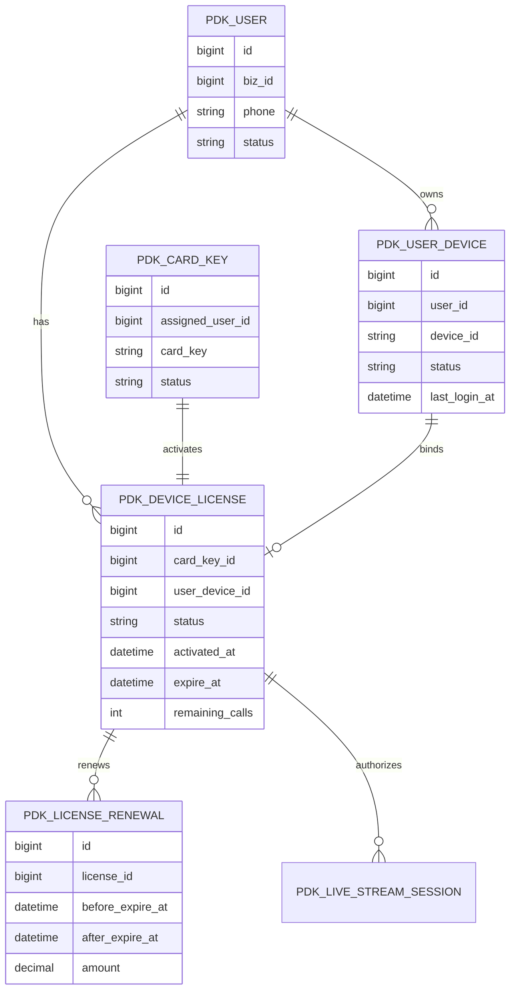

# ZHIBO_LIVE 多设备卡密许可证解决方案

> 文档状态：**第一版已实现并通过真实 MySQL 联调（2026-08-29）**。支持同一个 ZHIBO_LIVE
> 手机号拥有多张独立卡密、多台电脑同时登录，每张卡密绑定一个设备席位并拥有独立到期时间。

## 0. 结论、适用边界与 PDD 影响

### 0.1 会不会影响 PDD

不会。实现不是按 `appId == 3` 粗暴替换全局登录，而是在 `pdk_business.authorization_mode`
上配置授权模型：

| 业务 | appId | authorizationMode | 授权权威 | 结果 |
| --- | ---: | --- | --- | --- |
| PDD | 1 | `USER_SUBSCRIPTION` | `pdk_user.device_id/expire_time/remaining_calls` | 继续使用原单设备、用户级套餐方案 |
| ZHIBO_AI | 2 | `USER_SUBSCRIPTION` | 现有用户级字段 | 暂不强制设备许可证 |
| ZHIBO_LIVE | 3 | `DEVICE_LICENSE` | `pdk_user_device + pdk_device_license` | 使用一机一卡、多设备独立授权 |

登录控制器和安全拦截器同时识别两种主体：

```text
USER_SUBSCRIPTION -> loginId = userId
DEVICE_LICENSE    -> loginId = "license:" + deviceLicenseId
```

因此 PDD 注册试用、卡密核销、小号分配、次数扣减、单设备互踢路径均未迁移。原有 PDD
回归测试与本次全部后端测试一起通过。

### 0.2 一手机号一卡与一手机号多卡是否使用同一方案

是。以后凡是要求“卡密决定电脑使用权”的业务，都使用 `DEVICE_LICENSE`：

- 分配 1 张卡 = 允许 1 台电脑；
- 分配 10 张卡 = 允许 10 台电脑；
- 第 11 台必须再有第 11 张分配给该手机号的卡；
- 不再维护“一卡版”和“多卡版”两套代码；
- 是否允许用户自助注册由 `registration_mode` 独立控制，与授权模型不耦合；
- 新业务可在后台选择授权模型，不需要复制 ZHIBO_LIVE 登录代码。

授权模型不是可以随时切换的普通开关：后台要求先关闭业务，且业务一旦已有用户就拒绝直接切换。
这样可以避免把已有 PDD 用户突然解释成许可证用户。需要迁移时应新建业务或编写专项数据迁移，而不是在线改配置。

注意：`DEVICE_LICENSE` 第一版不支持用户级免费试用。若要试用，应给用户分配一张短期、
零元的试用许可证卡，避免同时存在用户试用期限和卡密期限两套授权权威。

## 1. 业务目标

以用户 `13454118763` 被分配 10 张卡密为例：

- 用户仍只有一个手机号和一个登录密码；
- 10 张卡密代表 10 个独立设备许可证；
- 每台电脑使用自己的稳定设备 UUID，并绑定其中一张卡密；
- 10 台电脑可以同时登录和使用；
- 第 11 台电脑没有新的有效卡密时禁止完成登录；
- 同一张卡密不能同时绑定两台电脑；
- 每张卡密独立激活、独立到期、独立续费、独立作废；
- 某张卡到期只停止对应电脑，不影响该手机号下其他有效设备；
- 卡密续费后卡号不变，产生新的续费销售记录；
- 卡密到期后，该设备禁止所有付费业务和视频推流。

## 2. 本方案的业务约定

以下约定作为第一版实现基线：

1. **一张卡密等于一个设备授权席位**，不是一个用户级套餐。
2. 卡密必须先由管理员/代理分配给指定手机号，不能让任意用户捡到未售卡后激活。
3. 有效期默认在卡密第一次绑定设备时开始计算。
4. 解绑和换电脑不会暂停有效期；剩余时间继续流逝。
5. 原电脑可自行解绑；原电脑不可用时由管理员后台强制解绑。
6. 续费使用原卡密，`expireAt = max(当前时间, 原expireAt) + 续费时长`。
7. 到期设备仍可登录受限页面，以便查看状态、续费、注销和解绑；业务操作全部禁止。
8. 服务端是许可证授权的最终权威，客户端时间和 UI 状态不能作为安全依据。
9. 当前按每张许可证独立维护直播次数；后续可以扩展分钟数、码率和清晰度权益。

如果希望“10 张卡在管理员发放当天统一开始、统一到期”，只需要增加批次固定起止时间策略，
不改变本文的设备许可证模型。

## 3. 领域模型



核心变化是把“身份、设备、许可证”拆开：

```text
User       = 谁在使用（手机号、密码、冻结状态）
Device     = 哪台电脑（稳定 UUID、设备状态）
License    = 这台电脑是否有权使用（卡密、到期时间、次数）
Session    = 这台电脑当前登录和推流的运行状态
```

## 4. 数据库最终结构

项目允许重建数据库，因此直接修改 `schema-mysql.sql` 为最终 CREATE TABLE，不增加 ALTER 兼容脚本。

### 4.1 用户表 `pdk_user`

用户表继续保存账号级信息：

```text
id
biz_id
phone
status                 ACTIVE / FROZEN
account_source
created_at / updated_at
```

对 ZHIBO_LIVE 而言，以下现有字段不再作为授权权威：

```text
device_id
expire_time
remaining_calls
max_accounts
```

这些字段可以为 PDD 等旧业务保留，但 ZHIBO_LIVE 必须从设备许可证表读取权益。

继续保留：

```sql
UNIQUE KEY uk_user_biz_phone (biz_id, phone)
```

### 4.2 用户设备表 `pdk_user_device`

```sql
CREATE TABLE `pdk_user_device` (
    `id` BIGINT AUTO_INCREMENT PRIMARY KEY,
    `biz_id` BIGINT NOT NULL,
    `user_id` BIGINT NOT NULL,
    `device_id` VARCHAR(128) NOT NULL,
    `device_id_hash` CHAR(64) NOT NULL,
    `device_name` VARCHAR(128) DEFAULT NULL,
    `platform` VARCHAR(32) DEFAULT NULL,
    `client_version` VARCHAR(32) DEFAULT NULL,
    `status` VARCHAR(20) NOT NULL DEFAULT 'ACTIVE'
        COMMENT 'ACTIVE/UNBOUND/BLOCKED',
    `first_bound_at` DATETIME NOT NULL DEFAULT CURRENT_TIMESTAMP,
    `last_login_at` DATETIME DEFAULT NULL,
    `last_seen_at` DATETIME DEFAULT NULL,
    `unbound_at` DATETIME DEFAULT NULL,
    `created_at` DATETIME NOT NULL DEFAULT CURRENT_TIMESTAMP,
    `updated_at` DATETIME NOT NULL DEFAULT CURRENT_TIMESTAMP ON UPDATE CURRENT_TIMESTAMP,
    UNIQUE KEY `uk_user_device` (`biz_id`, `user_id`, `device_id_hash`),
    INDEX `idx_device_user_status` (`biz_id`, `user_id`, `status`)
) ENGINE=InnoDB DEFAULT CHARSET=utf8mb4;
```

设备 UUID 的原文可用于客户端比对，hash 用于索引和安全查询。日志只输出 hash 前缀。

### 4.3 卡密表 `pdk_card_key`

增加“预分配”概念：

```text
assigned_user_id
assigned_phone
assigned_at
```

推荐状态：

```text
UNUSED       公司库存，尚未销售
ASSIGNED     已分配给指定手机号，尚未绑定设备
ACTIVATED    已生成设备许可证
VOID         已作废
```

卡密表负责“凭证和销售归属”，许可证表负责“是否有效及何时到期”。不要在两个表同时维护两套到期时间。

### 4.4 设备许可证表 `pdk_device_license`

```sql
CREATE TABLE `pdk_device_license` (
    `id` BIGINT AUTO_INCREMENT PRIMARY KEY,
    `biz_id` BIGINT NOT NULL,
    `user_id` BIGINT NOT NULL,
    `card_key_id` BIGINT NOT NULL,
    `user_device_id` BIGINT DEFAULT NULL,
    `package_id` BIGINT NOT NULL,
    `package_name_snapshot` VARCHAR(64) NOT NULL,
    `status` VARCHAR(20) NOT NULL DEFAULT 'UNBOUND'
        COMMENT 'UNBOUND/ACTIVE/EXPIRED/SUSPENDED/REVOKED',
    `activated_at` DATETIME DEFAULT NULL,
    `effective_at` DATETIME DEFAULT NULL,
    `expire_at` DATETIME DEFAULT NULL,
    `remaining_calls` INT NOT NULL DEFAULT 0,
    `total_calls` INT NOT NULL DEFAULT 0,
    `last_used_at` DATETIME DEFAULT NULL,
    `version` INT NOT NULL DEFAULT 0,
    `created_at` DATETIME NOT NULL DEFAULT CURRENT_TIMESTAMP,
    `updated_at` DATETIME NOT NULL DEFAULT CURRENT_TIMESTAMP ON UPDATE CURRENT_TIMESTAMP,
    `active_device_guard` BIGINT GENERATED ALWAYS AS (
        CASE WHEN `status` IN ('ACTIVE','SUSPENDED') THEN `user_device_id` ELSE NULL END
    ) STORED,
    UNIQUE KEY `uk_license_card` (`card_key_id`),
    UNIQUE KEY `uk_license_active_device` (`biz_id`, `active_device_guard`),
    INDEX `idx_license_user_status` (`biz_id`, `user_id`, `status`, `expire_at`),
    INDEX `idx_license_expiry` (`status`, `expire_at`)
) ENGINE=InnoDB DEFAULT CHARSET=utf8mb4;
```

数据库约束保证：

- 一张卡只能生成一个许可证；
- 一台设备只能占用一个活动许可证；
- 不依赖“先 count 再 insert”的非原子判断；
- 10 台电脑并发激活不会把同一张卡绑定两次。

### 4.5 许可证续费记录 `pdk_license_renewal`

```text
id
biz_id
license_id
card_key_id
user_id
renewal_order_no
before_expire_at
duration_hours
after_expire_at
added_calls
amount
payment_channel
operator_id
created_at
```

每次续费新增记录，不覆盖历史销售。原卡密保持不变。

### 4.6 登录审计

现有登录日志增加：

```text
user_device_id
device_license_id
license_status
license_expire_at
```

这样可以回答“第几台电脑、使用哪张卡、为什么登录失败”。

## 5. 管理后台流程

### 5.1 给手机号开通 10 个许可证

管理员操作：

1. 查找或创建手机号用户；
2. 选择 ZHIBO_LIVE 套餐模板；
3. 输入数量 10；
4. 生成 10 张卡密；
5. 将 10 张卡全部预分配给该用户；
6. 为 10 张独立卡分别生成可审计的销售收入记录和许可证明细（批量操作由同一次后台请求完成）；
7. 把 10 张卡安全发送给客户。

此时卡密是 ASSIGNED，许可证是 UNBOUND，还没有占用电脑。

### 5.2 管理页面

用户详情页增加“设备许可证”标签：

| 卡密 | 设备 | 状态 | 激活时间 | 到期时间 | 剩余次数 | 操作 |
| --- | --- | --- | --- | --- | --- | --- |
| PDK-****-****-1234 | 办公室电脑1 | ACTIVE | ... | ... | 20 | 续费/解绑/暂停/作废 |
| PDK-****-****-5678 | 未绑定 | UNBOUND | - | - | 20 | 作废 |

管理员支持：

- 批量生成后在一次性结果窗口查看、复制完整卡密；关闭窗口后列表只显示脱敏卡密；
- 单张续费；
- 勾选多张批量续费；
- 所有 10 张统一续期；
- 查看设备登录记录；
- 强制解绑；
- 暂停/恢复许可证；
- 作废卡密和立即停止对应直播；
- 查看销售和续费流水。

## 6. 客户端登录设计

### 6.1 登录请求

扩展当前登录 DTO，`cardKey` 为可选字段：

```http
POST /api/v1/client/auth/login
X-PDK-App-ID: 3

{
  "appId": 3,
  "phone": "13454118763",
  "password": "user-password",
  "deviceId": "ZL-DEVICE-UUID-01",
  "deviceName": "办公室电脑1",
  "clientVersion": "2.0.0",
  "cardKey": null
}
```

### 6.2 已绑定设备

服务端根据：

```text
bizId + userId + SHA256(deviceId)
```

找到设备和许可证，校验通过后直接签发该设备自己的登录 Token，不要求再次输入卡密。

### 6.3 新设备首次登录

如果密码正确但设备没有绑定：

```json
{
  "code": 40380,
  "message": "当前电脑尚未绑定许可证，请输入分配给您的卡密",
  "data": null
}
```

客户端显示卡密输入框，再次调用登录接口并携带 cardKey。

服务端在一个事务中：

1. 校验用户、密码和业务；
2. `SELECT ... FOR UPDATE` 锁定卡密；
3. 卡密必须为 ASSIGNED/ACTIVATED，且 assigned_user_id 等于当前用户；
4. 卡密不能绑定其他活动设备；
5. 创建或恢复用户设备记录；
6. 首次激活时计算独立 `expire_at`；
7. 原子绑定许可证与设备；
8. 签发设备级 Token。

### 6.4 第 11 台电脑

第 11 台电脑可能出现三种情况：

| 输入情况 | 结果 |
| --- | --- |
| 不输入卡密 | `40380`，需要许可证 |
| 输入前 10 张中已绑定的卡 | `40383`，卡密已绑定其他设备 |
| 输入不属于该手机号的卡 | `40382`，卡密未分配给当前账号 |
| 管理员确实新增并分配第 11 张卡 | 可以成为第 11 个合法席位 |

因此“最多 10 台”不靠一个容易并发失效的计数器，而是靠该用户实际拥有的卡密许可证数量。

## 7. 设备级登录会话

### 7.1 当前问题

当前 Sa-Token 使用 `userId` 作为 loginId，同一手机号的多台电脑无法形成独立会话。

### 7.2 推荐方案

ZHIBO_LIVE 登录使用：

```text
loginId = "license:" + deviceLicenseId
```

Sa-Token 的“同账号禁止并发”仍然保留，但作用域变成同一个许可证：

- 10 张许可证有 10 个不同 loginId，可以同时在线；
- 同一张许可证在同一时间只保留一个有效 Token；
- 同一设备重复登录会让该许可证的旧 Token 失效；
- 许可证暂停或作废时可以按 loginId 精确踢掉对应设备。

为尽量不影响 PDD：

- PDD 旧登录 ID 暂时继续使用纯 userId；
- ClientSecurityInterceptor 识别 `license:{id}` 和旧 userId 两种主体；
- ZHIBO_LIVE 强制使用 license 主体；
- 后续再统一迁移所有业务到设备主体。

请求上下文增加：

```text
pdkClientUser
pdkClientDevice
pdkClientLicense
```

业务服务不能再只接收 User，还要接收 ClientLicenseContext。

## 8. 服务端授权拦截

### 8.1 每次请求校验

ZHIBO_LIVE 每个付费业务请求都必须检查：

```text
业务 ACTIVE 且在部署 allowlist
用户存在且未 FROZEN
登录 Token 对应 deviceLicenseId
设备记录为 ACTIVE
请求头 deviceId 与绑定设备一致
许可证属于当前 userId/bizId/deviceId
许可证 status == ACTIVE
expire_at > 数据库 NOW()
remaining_calls > 0（需要扣次数的接口）
```

不能只在登录时检查。即使客户端保持在线，卡密到期后的下一次业务请求也必须立即失败。

### 8.2 到期后的接口分级

不建议真的禁止所有 HTTP 接口，否则用户无法续费和解绑。

到期后仍允许：

```text
POST /client/auth/login
GET  /client/account/profile
GET  /client/device-license/current
GET  /client/account/card
POST /client/auth/logout
POST /client/auth/unbind-device
POST /client/auth/change-password
```

到期后禁止：

```text
POST /client/zhibo-live/publish-tickets
所有资源获取和消费接口
所有实际直播/AI 业务接口
```

客户端登录后进入 `LICENSE_EXPIRED` 受限页面，不能进入直播控制台。

## 9. 许可证接口

### 客户端

```text
GET  /api/v1/client/device-license/current
GET  /api/v1/client/devices
GET  /api/v1/client/device-license/devices        # 同义路径，SDK/PyQt 使用
POST /api/v1/client/device-license/unbind
GET  /api/v1/client/device-license/renewal-history
```

`current` 返回：

```json
{
  "licenseId": 101,
  "cardKeyMasked": "PDK-12**-****-90AB",
  "deviceId": "ZL-DEVICE-UUID-01",
  "deviceName": "办公室电脑1",
  "status": "ACTIVE",
  "effectiveAt": "2026-08-29T10:00:00",
  "expireAt": "2026-09-29T10:00:00",
  "remainingCalls": 20,
  "serverTime": "2026-08-29T10:00:10"
}
```

### 管理后台

```text
GET  /api/v1/admin/users/{userId}/device-licenses
POST /api/v1/admin/users/{userId}/device-licenses/batch-assign
POST /api/v1/admin/device-licenses/{licenseId}/renew
POST /api/v1/admin/device-licenses/batch-renew
POST /api/v1/admin/device-licenses/{licenseId}/unbind
PUT  /api/v1/admin/device-licenses/{licenseId}/status
GET  /api/v1/admin/device-licenses/{licenseId}/login-history
```

## 10. ZHIBO_LIVE 推流适配

### 10.1 票据签发

当前直播票据从用户全局 `expireTime/remainingCalls` 读取权益，需要改为当前设备许可证：

```text
LiveStreamSession
  + user_device_id
  + device_license_id
```

申请票据时校验当前 Token 对应的许可证，不允许客户端上传任意 licenseId。

票据绑定：

```text
bizId
userId
userDeviceId
deviceLicenseId
deviceIdHash
path
mediaNodeCode
```

### 10.2 扣次数

第一次进入 LIVE 时：

```sql
UPDATE pdk_device_license
SET remaining_calls = remaining_calls - 1,
    last_used_at = NOW(),
    version = version + 1
WHERE id = ?
  AND status = 'ACTIVE'
  AND expire_at > NOW()
  AND remaining_calls > 0;
```

会话 `AUTHORIZED -> LIVE` 和许可证扣次必须在同一事务中，失败整体回滚。

### 10.3 卡密到期踢流

增加许可证到期任务，例如每 10～30 秒运行：

1. 查询 `status=ACTIVE AND expire_at<=NOW()`；
2. 条件更新为 EXPIRED；
3. 查找该 licenseId 的活动直播会话；
4. 调用 MediaMTX Control API kick；
5. 会话结束原因写 `LICENSE_EXPIRED`；
6. 向客户端下一次轮询返回过期状态。

定时任务用于主动收敛；每次 API 请求的即时校验才是安全底线。

## 11. 解绑和换电脑

### 11.1 用户主动解绑

只允许解绑当前 Token 对应设备：

1. 如果正在直播，先调用 MediaMTX kick；
2. 将设备记录改为 UNBOUND；
3. 将许可证 `user_device_id=NULL,status=UNBOUND`；
4. 保留原 expire_at 和 remaining_calls；
5. 踢掉当前许可证 loginId；
6. 写审计日志。

解绑后卡密剩余时间继续流逝。新电脑登录时输入原卡密重新绑定。

### 11.2 管理员解绑

原电脑损坏时管理员执行相同流程，并记录操作人、原因、原设备 hash 和 IP。

### 11.3 防滥用

建议增加：

- 单张许可证 24 小时最多自助换机 1 次；
- 7 天最多换机 3 次；
- 超限必须管理员审核；
- 频繁更换设备触发风控告警。

## 12. 客户端改造

客户端增加以下状态：

```text
DEVICE_LICENSE_REQUIRED
DEVICE_LICENSE_BINDING
LICENSE_ACTIVE
LICENSE_EXPIRED
LICENSE_SUSPENDED
LICENSE_REVOKED
DEVICE_UNBOUND
```

登录 UI：

- 默认只显示手机号和密码；
- 服务端返回 40380 后展开卡密输入框；
- 展示当前电脑 deviceId 和设备名称；
- 卡密只在本次请求内存中使用，不保存、不打印。

主页面展示当前设备自己的：

- 脱敏卡密；
- 到期时间和服务端校准倒计时；
- 剩余次数；
- 设备名称；
- 当前许可证状态。

客户端每 30～60 秒刷新 `/device-license/current`，但不能依靠本地轮询替代服务端校验。

## 13. 错误码建议

| code | 含义 | 客户端行为 |
| --- | --- | --- |
| `40380` | 新设备需要卡密 | 展开卡密输入框 |
| `40381` | 当前设备许可证已到期 | 进入续费受限页 |
| `40382` | 卡密未分配给当前手机号 | 提示联系代理核对 |
| `40383` | 卡密已绑定其他设备 | 禁止重试，提示解绑 |
| `40384` | 许可证暂停/作废 | 停止全部业务 |
| `40385` | 当前设备没有许可证 | 返回许可证绑定页 |
| `40980` | 当前设备已绑定另一张卡 | 显示当前卡，不重复绑定 |
| `40981` | 卡密并发绑定冲突 | 刷新许可证状态 |
| `40982` | 续费幂等号已被其他许可证使用 | 管理端生成新的 renewalOrderNo，禁止跨许可证复用 |
| `42980` | 换机过于频繁 | 联系管理员审核 |

业务错误继续使用 CommonResult，客户端判断 `code`，不能只看 HTTP 200。

## 14. 并发和事务要求

必须覆盖以下竞态：

1. 两台电脑同时使用同一张卡首次登录；
2. 同一电脑同时提交两张不同卡；
3. 激活和管理员作废同时发生；
4. 续费和到期任务同时发生；
5. 第一次 LIVE 扣次和许可证到期同时发生；
6. 用户解绑和管理员踢流同时发生。

处理原则：

- 卡密激活使用行锁；
- 设备绑定依赖唯一索引；
- 状态更新使用 `WHERE status/version` CAS；
- 续费、财务流水和许可证更新同一事务；
- 到期时间使用数据库时间；
- 重复请求使用 clientRequestId/renewalOrderNo 幂等；renewalOrderNo 只能重放到原许可证，跨许可证复用必须报错；
- 不允许捕获冲突后继续返回成功。

## 15. 安全要求

- 卡密只通过 HTTPS 和可选加密信封传输；
- 数据库可以存卡密原文用于业务查询，但日志和 API 默认脱敏；更高安全要求可保存查找 hash + 加密密文；
- Token 登录主体必须绑定 licenseId 和 deviceId；
- 客户端不能自行提交 userId/licenseId 选择授权；
- 所有查询包含 bizId，防止 ZHIBO_AI/ZHIBO_LIVE 串数据；
- 到期判断不能相信客户端时间；
- 管理员批量分配、续费、解绑、作废全部写审计；
- 作废或冻结必须立即停止对应 MediaMTX 推流；
- 客户端日志脱敏 password/token/cardKey/publishUrl。

## 16. 测试与验收

### 16.1 核心验收

1. 给同一手机号分配 10 张卡。
2. 10 台不同 deviceId 分别使用一张卡登录，全部成功。
3. 第 11 台不带新卡登录，返回 40380，不能获得业务 Token。
4. 第 11 台复用前 10 张任一卡，返回 40383。
5. 两台电脑并发抢同一卡，只有一台成功。
6. 10 台电脑可以同时保持登录，Token 相互不踢。
7. 同一设备重复登录只替换本设备旧 Token。
8. 一张卡到期后，该设备不能申请推流票据，其他 9 台不受影响。
9. 到期时正在直播，MediaMTX 连接被主动踢掉。
10. 到期设备仍能登录查看状态、续费、注销和解绑。
11. 原卡密续费后恢复使用，卡号不变并新增续费销售记录。
12. 解绑后原设备失效，新设备使用原卡重新绑定成功，expireAt 不延后。

### 16.2 数据隔离

- 同手机号在 appId=2 和 appId=3 的设备许可证互不可见；
- PDD 的 maxAccounts 不影响 ZHIBO_LIVE 设备数量；
- 代理只能管理自己业务范围和自己销售的卡；
- SUPER_ADMIN 可以查看全部设备许可证和财务记录。

### 16.3 到期边界

- `expire_at` 前 1 秒允许；
- `expire_at` 时刻及之后禁止业务；
- 客户端本机时间提前/延后都不能绕过；
- 到期任务延迟不影响请求侧即时拒绝；
- 续费与到期任务并发后最终状态和 expireAt 正确。

## 17. 实施顺序

### 第一阶段：数据模型

- 最终 schema；
- 设备、许可证、续费实体与 Mapper；
- 卡密预分配和独立有效期；
- 管理后台设备许可证列表。

### 第二阶段：登录与拦截器

- 登录 DTO 增加可选 cardKey/deviceName/clientVersion；
- license loginId；
- 新设备首次绑定事务；
- 许可证上下文和付费接口拦截。

### 第三阶段：客户端

- 新设备要求卡密的登录流程；
- 当前许可证页；
- 到期受限页；
- 解绑换机；
- 多设备错误处理和安全日志。

### 第四阶段：直播与到期

- LiveStreamSession 绑定 licenseId；
- 按许可证扣次；
- 到期任务；
- MediaMTX 精确踢流；
- 直播会话与许可证审计。

### 第五阶段：测试和发布

- 10/11 台并发自动化测试；
- 同卡并发抢占测试；
- 到期与续费竞态测试；
- 灰度发布和监控；
- 管理后台财务核对。

## 18. 完成定义

只有同时满足以下条件才算支持该业务：

- 数据库存在用户—设备—许可证的一对多关系；
- 卡密拥有独立许可证和到期时间；
- 登录 Token 能精确识别某台设备的某张许可证；
- 第 11 台无法复用前 10 张卡；
- 服务端每次业务请求检查许可证；
- 到期能阻止业务并停止正在进行的直播；
- 客户端具备许可证绑定、到期受限和换机流程；
- 管理后台能分配、续费、解绑、暂停和审计每张卡；
- 10 台并发与同卡抢占测试全部通过。

## 19. 已落地代码清单

### 19.1 数据库和业务配置

- `schema-mysql.sql` 已加入 `authorization_mode`，PDD 固定为 `USER_SUBSCRIPTION`，
  ZHIBO_LIVE 固定为 `DEVICE_LICENSE`；
- 已加入 `pdk_user_device`、`pdk_device_license`、`pdk_license_renewal`；
- `pdk_card_key` 已加入预分配用户和 `ASSIGNED` 状态；
- `pdk_login_log` 已纳入最终 schema，并记录 device/license/到期状态；
- `pdk_live_stream_session` 已绑定 `user_device_id/device_license_id`，活动流唯一约束从用户改为许可证主体；
- 按项目约定未增加任何 `ALTER TABLE` 兼容 SQL。

### 19.2 后端

- 登录 DTO 已支持 `cardKey/deviceName/platform/clientVersion`；
- 新设备无卡、错卡、复用卡分别返回 `40380/40382/40383`；
- 已绑定设备无需重复输入卡密；
- Sa-Token 使用 `license:{id}`，同手机号多卡可同时在线；
- 安全拦截器默认拦截所有许可证业务接口，仅对白名单内的资料、卡密状态、消费历史、注销和解绑放行；
- 已实现客户端许可证查询、设备列表、续费历史和自助解绑；
- 已实现管理端批量分配、完整卡密一次性展示/复制、列表脱敏、勾选单张/批量续费、解绑、暂停、恢复、作废、登录历史；
- 代理只能操作自己生成/分配的许可证，超级管理员可操作全部；
- 续费按 `max(now, expireAt) + duration`，支持绑定到目标许可证的 `renewalOrderNo` 幂等，原卡不变并新增财务/续费记录；
- 旧“按卡密续费/作废”后台入口已委托到同一许可证服务，统一许可证→卡密锁顺序；作废不可恢复；
- 批量续费逐许可证写审计；客户端主动解绑写入带 licenseId/deviceId 的登录安全日志；
- 用户冻结、密码重置、许可证暂停/作废会按许可证精确踢登录和直播；
- 每 15 秒扫描过期许可证并主动停止对应 MediaMTX 会话；请求侧仍会即时检查到期，安全不依赖定时任务。

### 19.3 ZHIBO_LIVE

- 推流票据从当前登录上下文取 license/device，客户端不能自行指定 licenseId；
- MediaMTX HTTP Auth 再次检查用户、设备、许可证状态、独立到期时间和次数；
- MediaMTX source available 事件首次进入 LIVE 时，从该许可证原子扣减次数；
- 当前流查询和停止操作按许可证隔离，同一手机号的一台电脑不能操作另一台电脑的流；
- 到期、解绑、暂停、作废均会调用 MediaMTX Control API 停止相应许可证的活动流。

### 19.4 管理后台、PyQt 和 SDK

- 业务管理页可配置并展示 `USER_SUBSCRIPTION / DEVICE_LICENSE`；
- 新增“设备许可证”管理页，支持按业务/手机号查客户、分配席位、续费、解绑、暂停/恢复/作废；
- PyQt 登录区已增加“设备许可证卡密”，收到 `40380` 时自动聚焦该输入框；
- PyQt HTTP 调试卡和 Python SDK 登录均支持可选卡密，且卡密继续按敏感字段脱敏；
- Python SDK 已增加当前许可证、设备列表、续费历史和许可证解绑接口。

## 20. 已执行验证

### 20.1 自动化

```text
后端 Maven：68 tests, 0 failures, 0 errors, 0 skipped
管理后台：vue-tsc + vite build 通过
Python：client-pyqt 与 sdk/python/pdk compileall 通过
```

新增单元测试覆盖：已绑定设备免卡登录、第 11 台无卡、卡不属于手机号、旧卡被其他设备占用、
首次激活独立计算有效期和单席位次数、续费与到期扫描并发时的锁内二次判断，
以及 renewalOrderNo 跨许可证复用拒绝、作废许可证禁止恢复。
原有 PDD 注册、卡密、单设备互踢、调度扣次测试保持通过。

### 20.2 真实 MySQL + Spring Boot 联调

使用独立临时数据库执行了完整 `schema-mysql.sql`，Spring Boot 健康检查为 `UP`，随后完成：

1. 后台启用 ZHIBO_LIVE，创建用户 `13454118763` 和一个设备许可证套餐；
2. 为该手机号一次分配 10 张卡；
3. `E2E-PC-01` 到 `E2E-PC-10` 分别使用一张卡登录，10 次均为 `code=200`；
4. 10 个 Token 对应 10 个不同 `licenseId`，每张卡各有 20 次和独立到期时间；
5. `E2E-PC-11` 不带卡返回 `40380`；
6. `E2E-PC-11` 复用第一张卡返回 `40383`；
7. 第一张卡续费后，原卡号和 licenseId 不变，到期时间顺延 720 小时、次数从 20 增至 40；
8. 管理员解绑后在新电脑使用原卡重新绑定成功，到期时间未重算、剩余次数仍为 40；
9. 临时验证数据库 `pdk_license_verify` 已在验证结束后删除，未修改用户现有 `pdk_biz_db`。

## 21. 部署和数据库重建要求

本次是最终表结构，不包含 ALTER 迁移。旧数据库上的 `CREATE TABLE IF NOT EXISTS` 不会给旧表补列，
所以部署前必须：

1. 备份需要保留的数据；
2. 停止旧后端；
3. 删除并重建目标数据库（或使用新的空数据库名）；
4. 启动 Spring Boot，由 `spring.sql.init.mode=always` 自动执行 `schema-mysql.sql`；
5. 确认 `/actuator/health` 为 `UP`；
6. 在后台业务管理页确认 PDD=`USER_SUBSCRIPTION`、ZHIBO_LIVE=`DEVICE_LICENSE`；
7. 创建 ZHIBO_LIVE 套餐、用户，再从“设备许可证”页面分配卡密；
8. 配置 MediaMTX 服务令牌后再执行真实 RTMP 推流验收。

不要在旧表未重建的情况下直接替换程序包，否则 `authorization_mode`、许可证表字段或直播会话字段
会与 Java 实体不一致并导致启动/查询失败。

## 22. 当前完成结论

文档第 18 节定义的代码能力已经落地：数据一对多、卡密独立期限、设备级 Token、第 11 台拒绝、
请求侧鉴权、到期/解绑踢流、客户端绑定流程和后台许可证管理均已实现。真实 MediaMTX + FFmpeg
推流仍需部署环境具备 MediaMTX 与 FFmpeg 后执行；后端 HTTP Auth、票据和精确许可证扣次代码已完成，
不影响本次 10/11 台许可证登录验收结论。
