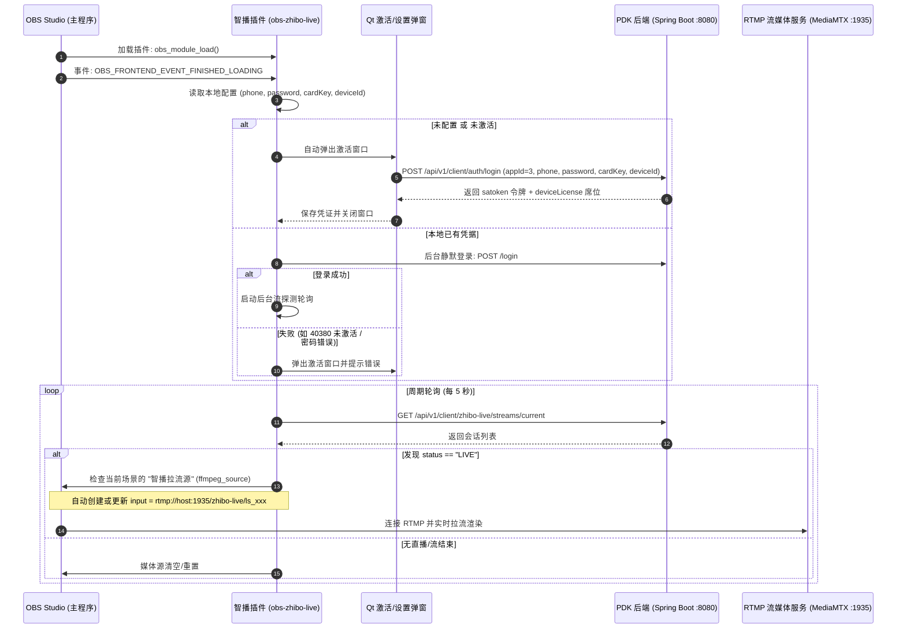

# PDK 智播云控 OBS 主动拉流插件 (obs-plugin-zhibo-live)

基于 **[obsproject/obs-plugintemplate](https://github.com/obsproject/obs-plugintemplate)** 标准规范开发，专门为 **PDK 智播云控平台 (`ZHIBO_LIVE / appId=3`)** 与 **智播豆客户端 (`E:\zhibodou`)** 打造的 OBS Studio 原生插件（C++ / Qt6）。

---

## 一、 核心功能特性

1. **OBS 启动自动装载**：
   - 监听 OBS 核心前端事件 `OBS_FRONTEND_EVENT_FINISHED_LOADING`，在 OBS 窗口渲染就绪后立即执行初始化。
2. **静默激活与未激活自动弹窗**：
   - **三要素认证**：支持 **用户名 (手机号)、登录密码、设备卡密**；
   - **后台自动激活**：首次启动或未配置时，**自动弹出 Qt6 原生激活窗口**引导输入；
   - **本地安全记忆**：配置与硬件唯一标识（UUID）保存在 OBS 插件标准配置目录，二次启动自动执行后台静默登录；
   - **设备席位绑定**：服务端自动根据卡密建立 1:1 设备席位绑定 (`DEVICE_LICENSE`)，并在界面实时展示独立到期时间与剩余计费次数。
3. **周期性活动流探测 (Stream Discovery)**：
   - 后台独立线程以可配置周期（默认 5 秒）轮询 PDK 服务端 `GET /api/v1/client/zhibo-live/streams/current`；
   - 实时识别当前账号与设备绑定的推流状态（`ISSUED` / `AUTHORIZED` / `LIVE` / `ENDED`）。
4. **主动 RTMP 拉流与 OBS 场景源自动化管理**：
   - 探测到 `LIVE` 活动流时，提取流路径 `path` 并拼接 RTMP 地址（如 `rtmp://127.0.0.1:1935/zhibo-live/ls_xxx`）；
   - **自动化场景注入**：自动在 OBS 当前活动场景中创建名为 **“智播拉流源”** 的官方媒体源（`ffmpeg_source`），并注入极低延迟缓冲参数（`buffering_mb=2, reconnect_delay_sec=2`）；
   - **自动断流清理**：直播结束（`ENDED`）或下线后，自动重置媒体源，避免 OBS 在后台无休止重连导致崩溃或日志刷屏。
5. **OBS 工具菜单集成**：
   - 在 OBS 顶部菜单 **“工具 (Tools)”** 注册 **“智播云控拉流设置 / 激活”**，方便主播随时重新激活、查看许可证详情或调整拉流参数。

---

## 二、 交互与工作时序图



---

## 三、 源码工程结构

```
obs-plugin-zhibo-live/
├── CMakeLists.txt                         # 顶级 CMake 构建脚本 (依赖 libobs, Qt6, nlohmann_json)
├── build.bat                              # Windows 一键编译批处理脚本
├── assets/
│   └── locale/
│       ├── zh-CN.ini                      # 简体中文语言包
│       └── en-US.ini                      # 英文语言包
└── src/
    ├── plugin-main.cpp                    # 插件生命周期入口 (obs_module_load / frontend 事件)
    ├── zhibo-config.hpp / .cpp            # 凭据、设备 ID 与参数本地持久化
    ├── zhibo-auth-client.hpp / .cpp       # PDK 后端通信客户端 (设备指纹、登录、激活、会话维护)
    ├── zhibo-stream-poller.hpp / .cpp     # 周期性活动流探测后台轮询器
    ├── zhibo-obs-source-manager.hpp / .cpp# OBS 场景源自动创建与 RTMP 更新控制器
    ├── ui/
    │   ├── activation-dialog.hpp / .cpp   # Qt6 激活与设置对话框 (手机号/密码/卡密/状态看板)
    └── utils/
        ├── http-client.hpp / .cpp         # 基于 Windows WinHTTP 的轻量级 HTTPS/HTTP 客户端
        └── json.hpp                       # nlohmann/json 单头文件解析库
```

---

## 四、 编译与安装指南

### 1. 环境准备
- 操作系统：Windows 10 / 11 (x64)
- 编译器：Visual Studio 2022 (MSVC 64-bit)
- 构建工具：CMake 3.20 或更高版本
- 依赖项：
  - **OBS Studio 29+**（安装包自带 libobs 或下载 OBS Studio 开发包 SDK）
  - **Qt 6**（例如 Qt 6.5+ / Qt 6.6+ MSVC 64-bit）

### 2. 环境变量配置 (可选)
如果 OBS 或 Qt 未安装在默认目录，可在编译前配置环境变量：
```cmd
set OBS_STUDIO_DIR=C:\Program Files\obs-studio
set Qt6_DIR=C:\Qt\6.5.3\msvc2022_64
```

### 3. 一键编译
在当前目录下直接运行：
```cmd
build.bat
```
或者手动通过 CMake 编译：
```cmd
cmake -B build -S . -DCMAKE_BUILD_TYPE=Release
cmake --build build --config Release
```
构建产物：`build/Release/obs-zhibo-live.dll`。

### 4. 插件安装到 OBS
1. 将编译产出的 `obs-zhibo-live.dll` 拷贝到 OBS 安装目录的插件目录：
   ```text
   C:\Program Files\obs-studio\obs-plugins\64bit\obs-zhibo-live.dll
   ```
2. 将 `assets\locale` 目录拷贝到：
   ```text
   C:\Program Files\obs-studio\data\obs-plugins\obs-zhibo-live\locale\
   ```
3. 启动 OBS Studio 即可自动加载。

---

## 五、 端到端联调测试步骤

1. **准备后台与推流客户端**：
   - 启动 PDK Spring Boot 后端 (`localhost:8080`) 与 MediaMTX 服务 (`localhost:1935`)；
   - 确保 `pdk_business` 表中 `ZHIBO_LIVE (appId=3)` 为 `ACTIVE`，并为测试手机号生成并分配了一张卡密（如 `PDK-8891-2041-9982`）；
   - 打开 `E:\zhibodou` 客户端，登录并处于准备推流状态。
2. **启动 OBS 验证激活**：
   - 启动 OBS Studio，等待主窗口加载完成；
   - 插件自动弹出 **“智播云控 - 客户端激活与拉流设置”** 对话框；
   - 输入手机号、登录密码以及卡密，点击 **“立即激活 / 登录”**；
   - 界面提示“激活成功！已绑定本设备席位”，对话框展示授权状态为 `已激活 (正常)`，到期时间与剩余次数同步更新；
   - 点击“关闭”或保留窗口。
3. **推流与自动拉流联动**：
   - 在 `E:\zhibodou` 客户端点击 **“开始直播推流”**；
   - 观察 OBS 插件日志或控制台：5 秒内后台轮询探测到活动流（`status: LIVE`，路径：`zhibo-live/ls_xxx`）；
   - 观察 OBS 主界面当前场景：自动多出一个名为 **“智播拉流源”** 的媒体源，并实时输出智播豆推流的音视频画面；
   - 在 `E:\zhibodou` 客户端点击 **“停止直播”**；
   - 插件在 5 秒内感知推流结束，自动重置 OBS 媒体源地址，平稳关闭播放。
